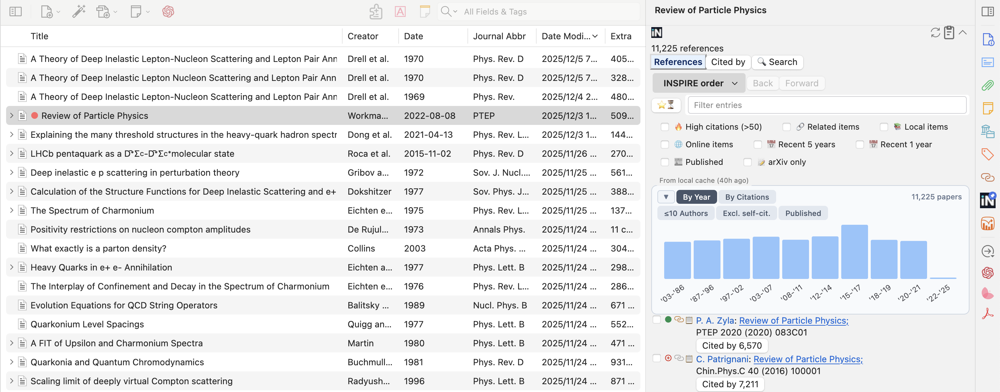

# Zotero INSPIRE Metadata Updater

[](https://www.zotero.org)
[](https://github.com/windingwind/zotero-plugin-template)

This is an add-on for the excellent open-source reference manager [Zotero](https://github.com/zotero/zotero). It connects your Zotero library to the [INSPIRE-HEP](https://inspirehep.net), which is a community maintained database for **high energy physics and related fields**. This add-on updates the metadata and citation counts (with and without self citations), and **lists references** of the selected item(s) in your Zotero library from [INSPIRE-HEP](https://inspirehep.net). 


## **VERY USEFUL NEW FEATURE**: INSPIRE References Section in the Item Pane 

When an item contains an INSPIRE record ID, the add-on injects an **INSPIRE References** section into Zotero’s item pane (can be pinned by right-clicking the INSPIRE logo on the right side). The pane section fetches the item’s reference list from INSPIRE-HEP, displaying each entry with:

- a filled or hollow circle indicating whether the reference already exists in your local library;
- a link/“not linked” icon showing whether the reference is linked as a related item.

Clicking the hollow circle opens the collection picker so you can import the reference into one or more collections; clicking the link icon links or unlinks the reference as a related item. This makes it easy to review INSPIRE references and pull missing ones into your library without leaving Zotero.



## Installation

### Pre-built binaries
- This version is compatible only with Zotero 7, whose stable version has been released. 
- The pre-built `.xpi` file can be downloaded from https://github.com/fkguo/zotero-inspire/releases/. If you want a version compatible with Zotero 6, download the version 0.2.20 from the releases. 

### Building from source
- Clone this repo
- Run `npm install` and `npm run build`

- In Zotero, the add-on can be installed by going to `Tools` → `Add-ons`, then click the top-right button and choose `Install Add-ons From File...`.
- It can be updated in `Add-ons Manager` → `Check for Updates`.


## Usage

- Right click a selected item or multiple selected items, click `Update INSPIRE Metadata`, then choose one of the three options: fetch the metadata with or without abstracts, or update only the citations with and w/o self citations (if the paper is not in the INSPIRE database, then update the [CrossRef](https://www.crossref.org/) citation counts).

- Right click a selected item or multiple selected items, click `Update INSPIRE Metadata`, then choose one of the three options: fetch the metadata with or without abstracts, or update only the citations with and w/o self citations.

- Right click a selected collection, then click one of the three options.

- Automatically retrieve the metadata from INSPIRE when adding a new item to the Zotero library. Options with or without getting abstracts can be set through the `Preferences` panel

- Metadata can be fetched as long as one of the following is provided:
	- DOI in the field of `DOI` or `Extra`; if it is only in `Extra`, then it should contain `DOI:` or `doi.org/` followed by the DOI.
	- arXiv link in `URL` or arXiv ID in `Extra` in the form of `arXiv:`.
	- INSPIRE Citation key in `Extra` in the form of `Citation Key: `. 
		- If one does not want to set the citation keys to the INSPIRE ones, then set `Set citekeys in Extra` in `INSPIRE Metadata Updater Preferences` under `Tools` menu to `No`.
	- INSPIRE `recid` in `Loc. in Archive` or the url containing `/literature/recid` in `URL`.

- The add-on will update the following fields:
	- **Notice**: the INSPIRE standard journal abbreviations (instead of the fill journal name) will be put into the `Publication` field.
	- INSPIRE uses a unique `recid` for each publication in the database (called `control_number` in the `.json` file obtained via the [INSPIRE API](https://github.com/inspirehep/rest-api-doc)). The INSPIRE `recid` is set to the field of `Loc. in Archive` (and `INSPIRE` to `Archive`) for the selected Zotero item.
		- This also enables to write look-up engines using this `recid` to exactly reach the INSPIRE page of that publication and its citations. The look-up engines can be added by editing the `engines.json` file in the `locate` folder of the Zotero Data Directory. The directory can be found by clicking `Zotero Preferences` → `Advanced` → `Files and Folders` → `Show Data Directory`. Add the following code to the `engines.json` file:
			```json
			{
				"_name": "INSPIRE",
				"_alias": "INSPIRE",
				"_description": "INSPIRE",
				"_icon": "https://inspirehep.net/favicon.ico",  // or local path to the INSPIRE icon,
				"_hidden": false,
				"_urlTemplate": "https://inspirehep.net/literature/{z:archiveLocation}",
				"_urlNamespaces": {
					"z": "http://www.zotero.org/namespaces/openSearch#"
				}
			},
			{
				"_name": "INSPIRE Citations",
				"_alias": "INSPIRE Citations",
				"_description": "INSPIRE citing papers",
				"_icon": "https://inspirehep.net/favicon.ico", 
				"_hidden": false,
				"_urlTemplate": "https://inspirehep.net/literature?q=refersto%3Arecid%3A{z:archiveLocation}",
				"_urlNamespaces": {
					"z": "http://www.zotero.org/namespaces/openSearch#"
				}
			},
			```

		- If the [Actions & Tags](https://github.com/windingwind/zotero-actions-tags) addon is installed, one may also setup the following action to copy the INSPIRE link of the selected item with right click or assigned shortcut keys 
			```js
			if (!item) {
				return "[Copy INSPIRE Link] not an item";
			}
			else {
			if (item.getField("archive") != "INSPIRE") {
				return "[Copy INSPIRE Link] item not in INSPIRE-HEP"
			}

			// get INSPIRE recid
			let recid
			recid = item.getField("archiveLocation")

			const clipboard = new Zotero.ActionsTags.api.utils.ClipboardHelper();

			let linkText;
			// Use title
			// linkText = item.getField("title");
			// Use citation key
			linkText = item.getField("citationKey");

			let link;
			// Use plain-text
			// link = `https://inspirehep.net/literature/${recid}`;
			// Use MarkDown
			link = `[${linkText}](https://inspirehep.net/literature/${recid})`
			clipboard
				.addText(link, "text/unicode")
				.addText(`<a href="https://inspirehep.net/literature/${recid}">${linkText}</a>`, "text/html")
				.copy();

			return `[Copy INSPIRE Link] link to ${linkText} copied.`
			}
			```	
	- `journal` (set to `Journal Abbr` in Zotero), `volume`, `year`, `pages` (either the page numbers or the modern article IDs), `issue`, `DOI`, `authors` ($\leq10$, otherwise keeping only the first 3; the author list will be updated if no author is given or the first name of the first author is empty), `title`, `abstract`, etc. 
	- Set the arXiv number of articles that are not published to the `Journal Abbr` field. Items of type `report` or `preprint` are set to `journalArticle`.
	- It will also get the citation counts with and without self-citations for each selected item. One can also choose to update only the citation counts using `Citation counts only` in the right-click menu. 
		- The current INSPIRE system does not display the citation count without self citations for a given paper. However, this number is in the metadata, and can be extracted with this add-on.
		- Citation counts are changed only when they are different from those of the last fetching.
	- The [Better BibTeX (BBT)](https://retorque.re/zotero-better-bibtex) plugin can pin the citation key from INSPIRE. When we add new arXiv articles, sometimes BBT fails to get the INSPIRE record. In that case, this plugin writes the INSPIRE citation key to the `Extra` field so that it is pinned correctly (the BBT plugin needs to be installed).
	- Work with the [INSPIRE Zotero translator](https://github.com/zotero/translators/blob/master/INSPIRE.js), and change `"_eprint"` in `Extra` to `arXiv`.
	- Erratum information and additional publication information added as notes.
- By default, those items that could not be found will be tagged as `⛔ No INSPIRE recid found`, which will be removed once it is in INSPIRE. The automatic tagging can be turned off in `Settings` → `INSPIRE Metadata Updater Preferences`.


## Settings

The add-on provides several customization options in `Tools` → `Add-ons` → `INSPIRE Metadata Updater` → `Preferences`:

### Field Order in Extra
Choose the order of fields in the `Extra` field:
- **Citations first** (default): Citation counts appear at the top, followed by arXiv ID and other fields
- **arXiv first**: arXiv ID appears at the top, followed by other fields, with citations at the bottom

### arXiv Primary Category Tag
Automatically add the arXiv primary category as a tag to items with arXiv IDs:
- When enabled, the add-on extracts the primary category from the arXiv ID and adds it as a tag
- Disabled by default

### Maximum Authors Display in Refs.
Maximum number of authors in reference list to display before using "et al." (default: 3)

## Additional tip for citing as you writing LaTeX

After building our own Zotero library, we can make the LaTeX writing process much more enjoyable in VS code (with the [LaTeX Workshop](https://github.com/James-Yu/LaTeX-Workshop) extension) with the [Zotero-cite](https://gitee.com/rusterx/zotero-cite) VS code extension. 
- usage:
	- press `Ctrl+Shift+P` or `Cmd+Shift+P`, choose `Zotero Cite: Cite and Create Bibliography for Pandoc/LaTeX` and bind a hotkey, e.g., `Alt+z`.
	- in `Settings` of VS code, set `Zotero-cite: Default Bib Name` to `./refs.bib`, which allows the extension update or create the `refs.bib` file under the same directory of the `.tex` file.
	- now when you're writing, press the hotkey, a Zotero reference picker window will pop up, select the references you want to cite, then it is cited with the `\cite{}` command and the `refs.bib` file gets automatically updated if the cited reference does not exist in the `bib` file. 

## References

I knew basically nothing about javascript or typescript. The first version of this add-on was developed by modifying the codes of the following two add-ons:

- https://github.com/bwiernik/zotero-shortdoi

- https://github.com/eschnett/zotero-citationcounts

The version from 0.3.0 on (for Zotero 7) was developed based on:

- https://github.com/windingwind/zotero-plugin-template

## License

Distributed under the Mozilla Public License (MPL) Version 2.0.
