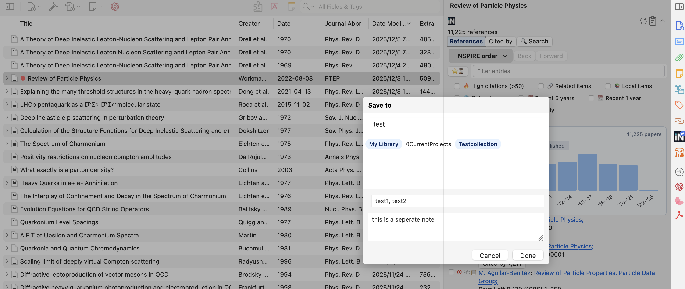

# Zotero INSPIRE References

[](https://www.zotero.org)
[](https://github.com/windingwind/zotero-plugin-template)

This add-on for the excellent open-source reference manager [Zotero](https://github.com/zotero/zotero) seamlessly integrates [INSPIRE-HEP](https://inspirehep.net), a community-maintained database for **high energy physics and related fields**, into your reference management workflow.

> 📖 **[中文功能说明](docs/FEATURES_CN.md)** - 详细的中文功能介绍

## Table of Contents

- [Zotero INSPIRE References](#zotero-inspire-references)
  - [Table of Contents](#table-of-contents)
  - [**VERY USEFUL FEATURE**: INSPIRE References Section in the Item Pane](#very-useful-feature-inspire-references-section-in-the-item-pane)
    - [Panel tabs](#panel-tabs)
    - [Smart filtering and sorting](#smart-filtering-and-sorting)
    - [Status indicators at a glance](#status-indicators-at-a-glance)
    - [Interactions and importing](#interactions-and-importing)
    - [Cached data and toolbar controls](#cached-data-and-toolbar-controls)
    - [Back/Forward Navigation](#backforward-navigation)
    - [INSPIRE Search from Search Bar (new in 1.1.2)](#inspire-search-from-search-bar-new-in-112)
  - [What's new](#whats-new)
    - [🆕 PDF Reader Citation Detection (v2.0.0)](#-pdf-reader-citation-detection-v200)
    - [Previous releases (1.1.x)](#previous-releases-11x)
  - [Installation](#installation)
    - [Pre-built binaries](#pre-built-binaries)
    - [Building from source](#building-from-source)
  - [Usage](#usage)
  - [Settings](#settings)
    - [Fetch INSPIRE Metadata for New Items](#fetch-inspire-metadata-for-new-items)
    - [Set Citekey in Extra Field](#set-citekey-in-extra-field)
    - [Field Order in Extra](#field-order-in-extra)
    - [arXiv Primary Category Tag](#arxiv-primary-category-tag)
    - [References Panel](#references-panel)
    - [PDF Reader Citation Detection (new in 2.0.0)](#pdf-reader-citation-detection-new-in-200)
    - [Local Cache (new in 1.1.3)](#local-cache-new-in-113)
    - [Reader View Navigation](#reader-view-navigation)
    - [INSPIRE Record Not Found](#inspire-record-not-found)
  - [Additional tip for citing as you writing LaTeX](#additional-tip-for-citing-as-you-writing-latex)
  - [References](#references)
  - [License](#license)

## **VERY USEFUL FEATURE**: INSPIRE References Section in the Item Pane

When an item contains an INSPIRE record ID, the add-on injects an **INSPIRE References** section into Zotero’s item pane (you can pin it by right-clicking the INSPIRE logo on the right). The pane pulls live data from INSPIRE-HEP so you can inspect, import, and link references without leaving Zotero.

### Panel tabs

- **References** lists the current item's bibliography using INSPIRE's canonical order.
- **Cited by** (new in 1.1.0) runs the official `refersto:recid:<ID>` search to show every record that cites the current item.
- **Entry Cited** appears when you click the citation count of a reference, letting you inspect who cites that specific entry.
- **Author Papers** opens when you click an author name.
- **🔍 Search** (new in 1.1.2) shows results when you search INSPIRE from Zotero's main search bar using the `inspire:` prefix; or you can search INSPIRE directly in the `Search tab` using usual INSPIRE syntax.

### Smart filtering and sorting

- Type multiple keywords to filter the visible entries; special characters are normalized automatically (e.g., `ä → ae`) so international names stay searchable.
- Switch among INSPIRE order, newest-first, or most-cited-first sorting to focus on relevance or recency.
- Filtering and sorting work consistently across all tabs, so you can stay inside the same pane for discovery.

### Status indicators at a glance

- `●` (green) means the entry already exists in your library, while `⊕` (red) signals it is missing and ready for import.
- The link icon is orange when the entry is already a related item and gray when the relation is absent.
- The clipboard icon (📋) fetches a BibTeX entry from INSPIRE and copies it directly to your clipboard.

### Interactions and importing

- Clicking `●` (green) jumps straight to the local item; **double-clicking `●` (green) opens the PDF directly** if available; clicking `⊕` (red) opens the import dialog where you can select the target library (personal or group), drop the item into one or more collections, resize the picker, and prefill tags or notes (the tag field supports auto-complete from existing tags).
- **Batch import (new in 1.1.4)**: Use checkboxes on the left side of entries to select multiple references, then click the **Import** button in the batch toolbar to import them all at once. The add-on will:
  - Detect duplicates before importing (based on recid, arXiv ID, or DOI)
  - Show a dialog listing duplicates where you can choose which ones to import or skip
  - Import all selected entries to the same target (library/collections/tags/notes) with progress tracking
  - Support cancellation via ESC key during import
- Use the link icon to relate or unlink items, or the clipboard icon to copy curated BibTeX snippets.
- Hover over a title to load its abstract tooltip; click the title to open the INSPIRE record in your browser.
- Clicking any citation count opens the Entry Cited tab, and clicking an author name opens Author Papers, so you can continue exploring and importing without leaving the panel.

### Cached data and toolbar controls

- Reference lists, citing records, abstract tooltips, and BibTeX payloads are cached for the session to reduce API calls.
- The panel toolbar provides two convenient buttons:
  - **Refresh button**: Bypass the cache and fetch fresh data from INSPIRE for the current view.
  - **Export button**: Click to open a menu with multiple export options:
    - **Copy to Clipboard**: Copy all references (or selected entries if any are checked) in BibTeX, LaTeX (US), or LaTeX (EU) format to your clipboard.
    - **Export to File**: Save all references (or selected entries if any are checked) to a `.bib` or `.tex` file for large reference lists that may exceed clipboard limits.
    - **Smart selection detection (new in 1.1.4)**: If you have selected entries using checkboxes, the export menu will show the count and only export selected entries; otherwise, it exports all visible entries.
- **Automatic local caching (new in 1.1.3)**: When persistent cache is enabled in Preferences, every time you open a recid the References list is written to disk (cited-by / author tabs honor the configurable TTL), so subsequent loads—or offline sessions—reuse the cached payload instantly.
- **Offline cache prefetch (new in 1.1.3)**: Right-click selected items or an entire collection, then choose `Download references cache` to pre-fetch the INSPIRE references into the local persistent cache (with a progress window and success/failure stats) so the panel can render instantly even when offline.

### Back/Forward Navigation

When you click `●` (green) to jump to an existing item in your library, the add-on remembers your navigation history. Use the **Back** and **Forward** buttons in the panel toolbar to navigate between previously viewed items—just like browser history. This works seamlessly across both the library view and the PDF reader view:

- Navigate from a reference in the reader's side panel to another item
- Click **Back** to return directly to the original reader tab
- If the reader tab was closed, you can optionally have it reopened automatically (configurable in Preferences)

### INSPIRE Search from Search Bar (new in 1.1.2)

Search INSPIRE directly from Zotero's main search bar by typing the `inspire:` prefix followed by your query:

- Type `inspire: a Witten` to search for papers by author Witten
- Type `inspire: t quark mass` to search for papers with "quark mass" in the title
- Type `inspire: arXiv:2305.12345` to search for a specific arXiv paper
- Press **Enter** to execute the search

Results appear in the new **🔍 Search** tab in the INSPIRE panel, where you can browse, filter, and import papers just like any other tab. Your last 10 searches are saved for quick re-access via the history dropdown.




## What's new

### 🆕 Architecture Refactoring (v2.1.0)

A major internal refactoring release focused on code quality, modularity, and maintainability:

- **Modular Panel Architecture**: Extracted 6 independent manager classes from the monolithic controller:
  - `ChartManager` - Statistics chart rendering and interaction
  - `FilterManager` - Text filtering, Quick Filters, and author/publication filters
  - `NavigationManager` - Back/forward navigation with scroll state preservation
  - `ExportManager` - BibTeX/LaTeX export to clipboard or file
  - `BatchImportManager` - Batch selection, duplicate detection, and import
  - `RowPoolManager` - Row pooling and template management (PERF-13 optimization core)

- **Performance Monitoring**: New `PerformanceMonitor` class for timing operations and detecting slow operations

- **Unit Test Coverage**: Added 153 unit tests using Vitest framework covering:
  - Text normalization and filtering
  - Filter predicates and Quick Filters
  - API type guards and utilities
  - PDF citation matching strategies

- **Chinese Localization**: Complete simplified Chinese translation (~370 lines) for all UI strings

- **Code Quality Improvements**:
  - Magic numbers replaced with named constants
  - Inline styles consolidated into style utilities
  - Filter methods unified with strategy pattern
  - Complete INSPIRE API type definitions with type guards

### 🆕 PDF Reader Citation Detection (v2.0.0)

A major new feature: **automatic citation detection in the PDF reader**!

- **Select text containing citations** (e.g., "see Refs. [1,2,3]") in the PDF reader
- The add-on **automatically detects citation patterns** and shows "INSPIRE Refs. [n]" buttons
- **Click to jump** to the corresponding reference in the References Panel
- **Supports multiple formats**: `[1]`, `[1,2,3]`, `[1-5]`, `[Smith 2024]`, `[arXiv:2301.12345]`, superscript digits
- **Optional fuzzy detection** for PDFs with broken text layers (e.g., truncated brackets)

### Previous releases (1.1.x)

- The multi-tab INSPIRE panel described above, including the new Cited by, Entry Cited, and Author Papers views with shared filtering/sorting controls.
- A richer import dialog that lets you pick personal or group libraries, select multiple collections, and prefill tags or notes before fetching items.
- Reader-friendly navigation with Back/Forward history that can reopen closed PDF reader tabs when desired.
- Inline abstract tooltips, BibTeX clipboard actions, and toolbar buttons (Refresh and Export with multiple format options) so you can inspect, copy, or update entries entirely inside Zotero.
- Filter supports common journal abbreviations such as "prl", "epja", "cpc", "ctp" etc.
- Statistics chart (by years or by citations): switched off by default.
- **INSPIRE Search from Search Bar** (1.1.2): Type `inspire:` followed by your query in Zotero's main search bar to search INSPIRE directly. Results appear in a new Search tab with full filtering/sorting support and search history.
- **Right-click cache download** (1.1.3): Right-click items or collections and choose `INSPIRE` → `Download references cache` to prefetch the long-lived References cache for offline use; the command reuses the same parsing logic as the References panel and reports success/failure counts.
- **Copy links in context menu** (1.1.4): Copy INSPIRE/zoteto links, BibTeX of selected item in the right-click `INSPIRE` submenu.
- **Batch import with duplicate detection** (1.1.4): Select multiple references using checkboxes, then import them all at once with automatic duplicate detection (recid/arXiv/DOI). The export button also respects checkbox selections—export only selected entries when any are checked, or export all when none are selected.

## Installation

### Pre-built binaries

- This version is compatible only with Zotero 7, whose stable version has been released.
- The pre-built `.xpi` file can be downloaded from https://github.com/fkguo/zotero-inspire/releases/. If you want a version compatible with Zotero 6, download the version 0.2.20 from the releases.

### Building from source

- Clone this repo
- Run `npm install` and `npm run build`
- In Zotero, the add-on can be installed by going to `Tools` → `Add-ons`, then click the top-right button and choose `Install Add-ons From File...`.
- It can be updated in `Add-ons Manager` → `Check for Updates`.

## Usage

- **Right-click a selected item or multiple selected items**, then click `INSPIRE` to access:

  - **Update Metadata**: Choose from three options:
    - `With abstracts` - Fetch full metadata including abstracts
    - `Without abstracts` - Fetch metadata excluding abstracts
    - `Citation counts only` - Only update citation counts (with/without self-citations; falls back to [CrossRef](https://www.crossref.org/) if INSPIRE record not found)
  - **Download references cache** (v1.1.3+): Prefetch INSPIRE references into local cache for offline use
  - **Copy actions** (v1.1.4+, item menu only):
    - `Copy BibTeX` - Fetch and copy BibTeX from INSPIRE
    - `Copy INSPIRE link` - Copy INSPIRE literature URL
    - `Copy citation key` - Copy item's citation key
    - `Copy Zotero link` - Copy Zotero select link
  - **Cancel update**: Cancel any ongoing update operation
- **Right-click a selected collection**, then click `INSPIRE` to access update and cache options for all items in the collection.
- Automatically retrieve the metadata from INSPIRE when adding a new item to the Zotero library. Options with or without getting abstracts can be set through the `Preferences` panel
- Metadata can be fetched as long as one of the following is provided:

  - DOI in the field of `DOI` or `Extra`; if it is only in `Extra`, then it should contain `DOI:` or `doi.org/` followed by the DOI.
  - arXiv link in `URL` or arXiv ID in `Extra` in the form of `arXiv:`.
  - INSPIRE Citation key in `Extra` in the form of `Citation Key: `.
    - If one does not want to set the citation keys to the INSPIRE ones, then set `Set citekeys in Extra` in `INSPIRE Metadata Updater Preferences` under `Tools` menu to `No`.
  - INSPIRE `recid` in `Loc. in Archive` or the url containing `/literature/recid` in `URL`.
- The add-on will update the following fields:

  - **Notice**: the INSPIRE standard journal abbreviations (instead of the fill journal name) will be put into the `Publication` field.
  - INSPIRE uses a unique `recid` for each publication in the database (called `control_number` in the `.json` file obtained via the [INSPIRE API](https://github.com/inspirehep/rest-api-doc)). The INSPIRE `recid` is set to the field of `Loc. in Archive` (and `INSPIRE` to `Archive`) for the selected Zotero item.
    - This also enables to write look-up engines using this `recid` to exactly reach the INSPIRE page of that publication and its citations. The look-up engines can be added by editing the `engines.json` file in the `locate` folder of the Zotero Data Directory. The directory can be found by clicking `Zotero Preferences` → `Advanced` → `Files and Folders` → `Show Data Directory`. Add the following code to the `engines.json` file:

      ```json
      {
      	"_name": "INSPIRE",
      	"_alias": "INSPIRE",
      	"_description": "INSPIRE",
      	"_icon": "https://inspirehep.net/favicon.ico",  // or local path to the INSPIRE icon,
      	"_hidden": false,
      	"_urlTemplate": "https://inspirehep.net/literature/{z:archiveLocation}",
      	"_urlNamespaces": {
      		"z": "http://www.zotero.org/namespaces/openSearch#"
      	}
      },
      {
      	"_name": "INSPIRE Citations",
      	"_alias": "INSPIRE Citations",
      	"_description": "INSPIRE citing papers",
      	"_icon": "https://inspirehep.net/favicon.ico", 
      	"_hidden": false,
      	"_urlTemplate": "https://inspirehep.net/literature?q=refersto%3Arecid%3A{z:archiveLocation}",
      	"_urlNamespaces": {
      		"z": "http://www.zotero.org/namespaces/openSearch#"
      	}
      },
      ```
    - If the [Actions &amp; Tags](https://github.com/windingwind/zotero-actions-tags) addon is installed, one may also setup the following action to copy the INSPIRE link of the selected item with right click or assigned shortcut keys

      ```js
      if (!item) {
      	return "[Copy INSPIRE Link] not an item";
      }
      else {
      if (item.getField("archive") != "INSPIRE") {
      	return "[Copy INSPIRE Link] item not in INSPIRE-HEP"
      }

      // get INSPIRE recid
      let recid
      recid = item.getField("archiveLocation")

      const clipboard = new Zotero.ActionsTags.api.utils.ClipboardHelper();

      let linkText;
      // Use title
      // linkText = item.getField("title");
      // Use citation key
      linkText = item.getField("citationKey");

      let link;
      // Use plain-text
      // link = `https://inspirehep.net/literature/${recid}`;
      // Use MarkDown
      link = `[${linkText}](https://inspirehep.net/literature/${recid})`
      clipboard
      	.addText(link, "text/unicode")
      	.addText(`<a href="https://inspirehep.net/literature/${recid}">${linkText}</a>`, "text/html")
      	.copy();

      return `[Copy INSPIRE Link] link to ${linkText} copied.`
      }
      ```
  - `journal` (set to `Journal Abbr` in Zotero), `volume`, `year`, `pages` (either the page numbers or the modern article IDs), `issue`, `DOI`, `authors` ($\leq10$, otherwise keeping only the first 3; the author list will be updated if no author is given or the first name of the first author is empty), `title`, `abstract`, etc.
  - Set the arXiv number of articles that are not published to the `Journal Abbr` field. Items of type `report` or `preprint` are set to `journalArticle`.
  - It will also get the citation counts with and without self-citations for each selected item. One can also choose to update only the citation counts using `Citation counts only` in the right-click menu.
    - The current INSPIRE system does not display the citation count without self citations for a given paper. However, this number is in the metadata, and can be extracted with this add-on.
    - Citation counts are changed only when they are different from those of the last fetching.
  - The [Better BibTeX (BBT)](https://retorque.re/zotero-better-bibtex) plugin can pin the citation key from INSPIRE. When we add new arXiv articles, sometimes BBT fails to get the INSPIRE record. In that case, this plugin writes the INSPIRE citation key to the `Extra` field so that it is pinned correctly (the BBT plugin needs to be installed).
  - Work with the [INSPIRE Zotero translator](https://github.com/zotero/translators/blob/master/INSPIRE.js), and change `"_eprint"` in `Extra` to `arXiv`.
  - Erratum information and additional publication information added as notes.

## Settings

The add-on provides several customization options in `Tools` → `Add-ons` → `INSPIRE Metadata Updater` → `Preferences`:

### Fetch INSPIRE Metadata for New Items

Control automatic metadata fetching when adding new items to your Zotero library:

- **With abstracts**: Fetch full metadata including abstracts (default)
- **Without abstracts**: Fetch metadata without abstracts
- **Citation counts only**: Only update citation counts, skip other metadata
- **Disabled**: Do not automatically fetch metadata for new items

### Set Citekey in Extra Field

Control whether INSPIRE citation keys are written to the `Extra` field:

- **INSPIRE citekey**: Write INSPIRE citation keys to `Extra` field (useful for Better BibTeX integration)
- **Disabled**: Do not write INSPIRE citation keys to `Extra` field

### Field Order in Extra

Choose the order of fields in the `Extra` field:

- **Citations first** (default): Citation counts appear at the top, followed by arXiv ID and other fields
- **arXiv ID first**: arXiv ID appears at the top, followed by other fields, with citations at the bottom

### arXiv Primary Category Tag

Automatically add the arXiv primary category as a tag to items with arXiv IDs:

- When enabled, the add-on extracts the primary category from the arXiv ID (e.g., `hep-ph`, `nucl-th`) and adds it as a tag
- Disabled by default

### References Panel

Configure the INSPIRE References Panel behavior:

- **Maximum authors to display**: Number of authors shown before "et al." in the references panel (range: 1-20, default: 3)
- **Enable statistics chart**: Show interactive statistics chart (by year/citations) at the top of the panel (disabled by default)
  - **Collapsed by default**: When enabled, the chart starts collapsed and can be expanded by clicking the toggle button (enabled by default)
- **Search history retention**: Number of days to keep INSPIRE search history (range: 1-365, default: 30)

### PDF Reader Citation Detection (new in 2.0.0)

Configure how the add-on detects citations in PDF reader:

- **Fuzzy citation detection (experimental)**: Enable aggressive citation detection for PDFs with broken text layers (e.g., truncated brackets). Disabled by default to avoid false positives.
- **Parse PDF reference list**: Parse the reference list from PDF to improve label-to-entry matching, especially useful for multi-citation references like `[1,2,3]`. Disabled by default.
  - **Force mapping on mismatch**: When enabled (default), if the PDF reference count diverges from INSPIRE, force PDF-based mapping and skip index fallback. This helps prevent wrong matches when PDF and INSPIRE have different reference lists.

### Local Cache (new in 1.1.3)

Control the persistent cache used for offline viewing:

- **Enable local cache**: Master toggle; when disabled only in-memory caches are used.
- **Show cache source indicator**: Displays whether the current view came from INSPIRE, memory, or local disk.
- **Compress cache files (gzip)**: Enabled by default. Uses the pako library to shrink large cache files by ~80% while keeping read/write transparent. Disable if you need raw JSON files.
- **Metadata enrichment settings** (new in 1.1.4): Control how reference metadata is fetched when loading cached references.
  - **Batch size**: Number of entries per metadata request (range: 25-110, default: 100). Lower values reduce INSPIRE API load but increase total requests.
  - **Parallel requests**: Number of concurrent batch requests (range: 1-5, default: 4). Lower values are gentler on INSPIRE servers.
- **Cache TTL (hours)**: Applies to Cited-by and Author tabs; References are always permanent.
- **Custom cache directory**: Leave empty to use the Zotero data directory or click "Browse…" / "Reset" to manage a custom folder.
- **Clear cache**: Removes all on-disk cache files and reports the number of entries deleted.

### Reader View Navigation

Control navigation behavior in the PDF reader:

- **Reopen reader tab when navigating back/forward**: When enabled, if the reader tab was closed, it will be reopened automatically when using Back or Forward navigation (disabled by default)

### INSPIRE Record Not Found

Handle items that could not be found in the INSPIRE database:

- **Add tag to items without INSPIRE record**: Tag items that could not be found in INSPIRE (enabled by default)
- **Tag name**: Customize the tag name used for items without INSPIRE records (default: `⛔ No INSPIRE recid found`)

## Additional tip for citing as you writing LaTeX

After building our own Zotero library, we can make the LaTeX writing process much more enjoyable in VS code (with the [LaTeX Workshop](https://github.com/James-Yu/LaTeX-Workshop) extension) with the [Zotero-cite](https://gitee.com/rusterx/zotero-cite) VS code extension.

- usage:
  - press `Ctrl+Shift+P` or `Cmd+Shift+P`, choose `Zotero Cite: Cite and Create Bibliography for Pandoc/LaTeX` and bind a hotkey, e.g., `Alt+z`.
  - in `Settings` of VS code, set `Zotero-cite: Default Bib Name` to `./refs.bib`, which allows the extension update or create the `refs.bib` file under the same directory of the `.tex` file.
  - now when you're writing, press the hotkey, a Zotero reference picker window will pop up, select the references you want to cite, then it is cited with the `\cite{}` command and the `refs.bib` file gets automatically updated if the cited reference does not exist in the `bib` file.

## References

I knew basically nothing about javascript or typescript. The first version of this add-on was developed by modifying the codes of the following two add-ons:

- https://github.com/bwiernik/zotero-shortdoi
- https://github.com/eschnett/zotero-citationcounts

Versions from 0.3.0 on (for Zotero 7) were developed based on:

- https://github.com/windingwind/zotero-plugin-template

Versions from 1.0.0 were developed with the help of verious AI tools

## License

Distributed under the Mozilla Public License (MPL) Version 2.0.
