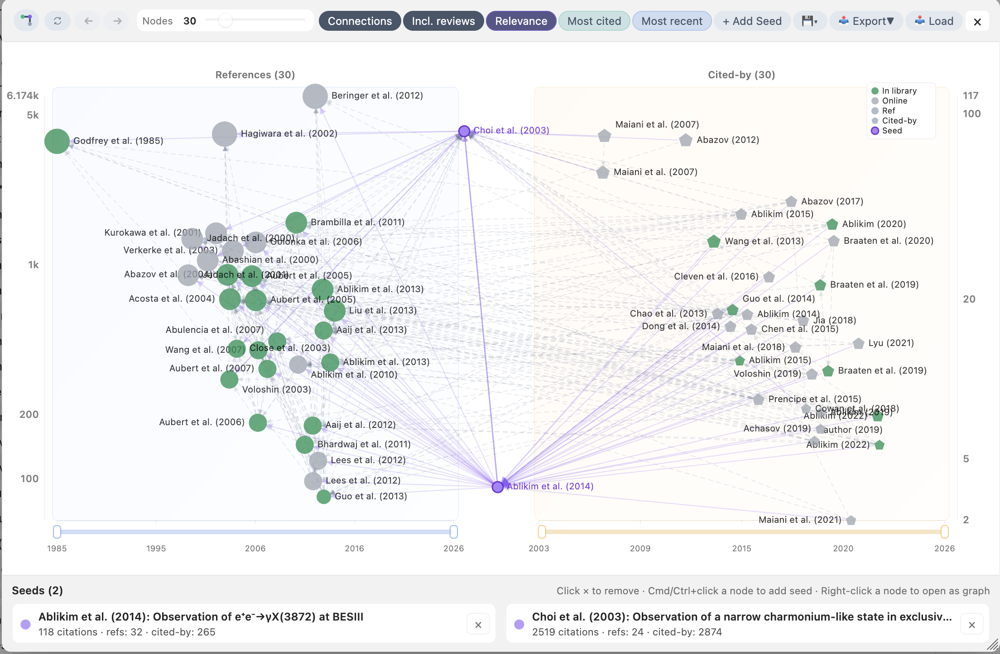

# Zotero INSPIRE 功能手册

本文档介绍 Zotero INSPIRE 插件的所有功能和使用方法。

## 目录

- [快速开始](#快速开始)
- [右键菜单功能](#右键菜单功能)
- [INSPIRE 引用面板](#inspire-引用面板)
- [PDF 阅读器集成](#pdf-阅读器集成)
- [预印本监控](#预印本监控)
- [偏好设置](#偏好设置)
- [使用技巧](#使用技巧)
- [故障排除](#故障排除)
- [与其他工具集成](#与其他工具集成)

---

## 截图

### 文献面板


### 引用关系图



## 快速开始

### 元数据更新

右键点击 Zotero 中的条目，选择 **INSPIRE** → **Update Metadata** → **With abstracts** 即可从 INSPIRE 获取完整元数据。

### 浏览参考文献

选中一个条目后，在右侧面板找到 **INSPIRE** 区块，即可查看该论文的参考文献列表、被引论文等。

### 搜索 INSPIRE

在 Zotero 搜索栏输入 `inspire: a Witten` 并按回车，可直接搜索 INSPIRE 数据库。

---

## 右键菜单功能

在 Zotero 中右键点击条目或合集，选择 **INSPIRE** 子菜单访问以下功能：

### 条目菜单

| 功能组               | 选项                         | 描述                                                          |
| -------------------- | ---------------------------- | ------------------------------------------------------------- |
| **更新元数据** | With abstracts               | 获取全部元数据，包括摘要                                      |
|                      | Without abstracts            | 获取元数据但不更新摘要字段                                    |
|                      | Citation counts only         | 只更新引用数（含/不含自引），无 INSPIRE 记录时回退到 CrossRef |
| **缓存**       | Download references cache    | 预先下载参考文献缓存，支持离线浏览                            |
| **复制**       | Copy BibTeX                  | 从 INSPIRE 获取并复制 BibTeX                                  |
|                      | Copy citation key            | 复制条目的 Citation Key                                       |
|                      | Copy INSPIRE link            | 复制 INSPIRE 文献链接                                         |
|                      | Copy INSPIRE link (Markdown) | 复制 Markdown 格式链接                                        |
|                      | Copy Zotero link             | 复制 Zotero 选择链接                                          |
|                      | Copy Funding Info            | 从 PDF 致谢部分提取并复制资助信息                             |
| **合作组标签** | Add Collaboration Tags       | 为大型合作组论文添加合作组标签                                |
| **预印本**     | Check Preprint Status        | 检查预印本是否已正式发表                                      |
| **操作**       | Cancel update                | 取消正在进行的更新操作                                        |
| **收藏**       | Toggle Favorite Paper        | 切换当前条目的收藏状态                                        |

### 合集菜单

| 功能组               | 选项                           | 描述                           |
| -------------------- | ------------------------------ | ------------------------------ |
| **更新元数据** | With abstracts                 | 获取全部元数据，包括摘要       |
|                      | Without abstracts              | 获取元数据但不更新摘要字段     |
|                      | Citation counts only           | 只更新引用数                   |
| **缓存**       | Download references cache      | 预先下载参考文献缓存           |
| **预印本**     | Check Preprints in Collection  | 检查合集中的预印本是否已发表   |
|                      | Check All Preprints in Library | 检查整个库中的所有预印本       |
| **合作组标签** | Reapply Collaboration Tags     | 重新应用合作组标签到合集中条目 |
| **操作**       | Cancel update                  | 取消正在进行的更新操作         |

---

## INSPIRE 引用面板

在条目详情面板中，INSPIRE 插件添加了一个专用面板。

### 标签页

| 标签页                  | 功能描述                                                        |
| ----------------------- | --------------------------------------------------------------- |
| **References**    | 显示当前文献的参考文献列表                                      |
| **Cited by**      | 显示引用当前文献的所有论文                                      |
| **Related**       | 基于混合相似度（共享参考文献 + 共引）推荐相关论文（相关性排序） |
| **Entry Cited**   | 查看某条参考文献的被引记录（点击引用数）                        |
| **Author Papers** | 查看某位作者的所有论文（点击作者名）                            |
| **🔍 Search**     | INSPIRE 搜索结果                                                |
| **⭐ Favorites**  | 收藏的作者和论文                                                |

### Related（相关论文推荐）

**Related** 标签页会基于当前论文的参考文献，采用“共享参考文献 + 共引（co-citation）”的混合算法推荐可能相关的论文：

- **阶段 1：书目耦合（shared references）**：从当前论文的参考文献中选取一组“锚点参考文献”，抓取引用这些锚点的论文作为候选，并按共享锚点（带权重）聚合得到 `couplingScore`。
- **阶段 2：共引重排（co-citation）**：对 top `T=25` 的候选，查询“同时引用 seed 与 candidate”的论文数 `co`，并计算 `coCitationScore = co / sqrt(seedCites * candCites)`（归一化余弦相似度，截断到 `[0,1]`）。共引权重 `α` 随 seed 被引数 sigmoid 增长，上限 50%（`seedCites < 5` 时 `α=0`）。
- **最终得分**：`combinedScore = (1-α) * couplingScore + α * coCitationScore`。其中 anchor 权重实现为 `w_r = 1 / (1 + log1p(c_r))`（高被引、过于通用的参考文献贡献更小）。
- **默认过滤**：默认会避开 PDG 的 *Review of Particle Physics*（过于通用，容易破坏相关性），并可在偏好设置中选择是否排除综述类文章。
- **缓存**：推荐结果会写入本地缓存，便于重复打开时快速加载。

### Citation Graph（引用图）

**Citation Graph** 提供 1-hop 的引用关系可视化：左侧为 References，右侧为 Cited-by，中间为 Seeds（支持多 seed 合并）。

- **打开方式**：面板工具栏按钮（以当前条目为 seed）；主工具栏搜索框旁的按钮（无 seed 时可在空画布中添加）；右键菜单可打开 Combined Citation Graph（多 seed）。
- **交互**：单击节点（若已在库中则可跳转）；右键节点可重置 seed；Cmd/Ctrl+单击节点可添加为 seed；拖拽平移；Cmd/Ctrl+滚轮缩放。
- **时间窗口**：每侧 x 轴下方都有时间范围 slider（左右独立），可缩放时间窗口，窗口外节点会隐藏以减少拥挤。
- **综述开关**：Incl./Excl. reviews 可控制是否纳入综述文章（包括 PDG RPP）。

### INSPIRE 搜索

有两种方式搜索 INSPIRE：

**方式一：从 Zotero 搜索栏**

1. 在 Zotero 主窗口搜索栏输入 `inspire:` 前缀，后跟搜索词
2. 按 Enter 执行搜索
3. 结果显示在面板的 Search 标签页中

**方式二：从面板搜索框**

1. 点击面板的 **🔍 Search** 标签页
2. 在搜索框中直接输入 INSPIRE 搜索语法（无需 `inspire:` 前缀）
3. 按 Enter 或点击搜索按钮执行搜索

**搜索语法示例**：

| 语法                        | 说明                            |
| --------------------------- | ------------------------------- |
| `a S Weinberg`            | 搜索作者名为 S. Weinberg 的论文 |
| `t quark mass`            | 搜索标题包含 quark mass 的论文  |
| `arXiv:2305.12345`        | 搜索特定 arXiv 编号             |
| `j Phys.Rev.D`            | 搜索发表在 Phys.Rev.D 的论文    |
| `a Weinberg and t chiral` | 组合搜索：作者 + 标题关键词     |
| `topcite 100+`            | 搜索引用数超过 100 的论文       |
| `eprint hep-ph`           | 搜索 hep-ph 分类的预印本        |

搜索历史会自动保存，可通过下拉菜单快速访问最近的搜索。

### 统计图表

在 References、Cited by 和 Author Papers 标签页中，面板顶部显示统计图表：

- **两种视图**：按年份分布 / 按引用数分布
- **交互筛选**：点击柱状图筛选条目，Ctrl/Cmd+点击多选, 按住Shift点击选择区间
- **折叠/展开**：点击按钮收起图表节省空间
- **作者数过滤**：点击"≤10 Authors"排除大型合作组论文
- **非自引过滤**：点击"Excl. self-cit."排除自引（By citations 视图以及作者 profile）
- **Published 过滤**：点击"Published"仅显示正式发表的论文

### 搜索与过滤

- **多词搜索**：输入多个词，所有词必须匹配
- **短语搜索**：用双引号包裹文本精确匹配，如 `"Phys Rev Lett"`
- **期刊缩写**：支持 `"PRL"`、`"JHEP"`、`"PRD"` 等常见缩写
- **特殊字符**：自动处理 ä→ae 等转换
- **排序**：原始顺序 / 最新优先 / 最多引用优先
- **快速筛选**：点击 Filters 按钮使用预设（高引用、关联条目、本地条目、已发表等）

### 状态指示

| 图标        | 含义                   |
| ----------- | ---------------------- |
| ● (绿色)   | 本地库中已有此条目     |
| ⊕ (红色)   | 可点击添加到库         |
| 🔗 (绿色)   | 已关联为相关条目       |
| 🔗 (灰色)   | 未关联                 |
| 📄 (绿色)   | 有 PDF 附件 - 点击打开 |
| ⬇️ (蓝色) | 可查找全文             |
| 📄 (灰色)   | 无 PDF / 未在库中      |
| 📋          | 复制 BibTeX            |
| T           | 复制 TeX Key           |

### 交互操作

| 操作              | 效果                        |
| ----------------- | --------------------------- |
| 点击绿色圆点      | 跳转到本地条目              |
| 双击绿色圆点      | 直接打开 PDF                |
| 点击红色圆点      | 打开导入对话框              |
| 点击链接图标      | 关联/取消关联为相关条目     |
| 点击绿色 PDF 图标 | 打开 PDF 附件               |
| 点击蓝色下载图标  | 触发查找全文功能            |
| 点击剪贴板图标    | 复制 BibTeX 到剪贴板        |
| 点击 T 按钮       | 复制 TeX Key 到剪贴板       |
| 点击引用数        | 查看该条目的被引记录        |
| 点击标题          | 在浏览器中打开 INSPIRE 页面 |
| 悬停标题          | 显示摘要                    |
| 点击作者名        | 查看该作者的所有论文        |
| 悬停作者名        | 显示作者资料卡片            |
| 右键点击条目      | 显示收藏/取消收藏菜单       |

### 收藏功能

**⭐ Favorites 标签页**可以快速访问您收藏的作者、论文和学术报告：

- **收藏作者**：在 Author Papers 标签页中点击星形按钮（☆/★），或在作者预览卡片中点击星形按钮
- **收藏论文与报告**：在 INSPIRE 面板中右键点击任意条目，选择"收藏论文"（或"收藏报告"），或在 Zotero 主窗口的右键菜单中操作。类型为 "Presentation" 的条目会自动分类到 "Favorite Presentations" 一栏。
- **快速访问**：所有收藏内容显示在 Favorites 标签页中（分为作者、论文、报告三类），支持各分类内拖拽排序
- **筛选**：使用文本筛选框在收藏列表中搜索

### 作者资料卡片

悬停在作者名称上时，会显示作者资料预览卡片：

| 内容                 | 说明                                       |
| -------------------- | ------------------------------------------ |
| **姓名与 BAI** | 显示全名及 INSPIRE 作者标识符 (BAI)        |
| **当前职位**   | 所属机构和职位（如有）                     |
| **研究领域**   | arXiv 分类（如 hep-ph, nucl-th）           |
| **快捷链接**   | 📧 Email、🆔 ORCID、🔗 INSPIRE、🌐 主页    |
| **查看论文**   | 点击"View Papers"跳转到 Author Papers 标签 |

**交互方式**：

- 悬停后延迟 300ms 显示
- 鼠标移开后延迟 600ms 隐藏
- 点击链接可发送邮件、打开 ORCID/INSPIRE 页面
- 右键点击链接可复制（邮箱地址、ORCID）

### 键盘导航

| 按键             | 功能                           |
| ---------------- | ------------------------------ |
| ↑ / k           | 导航到上一条目                 |
| ↓ / j           | 导航到下一条目                 |
| ←               | 后退                           |
| →               | 前进                           |
| Home / End       | 跳转到列表首/尾                |
| Enter            | 打开 PDF / 选中条目 / 触发导入 |
| Space / l        | 切换关联状态                   |
| Tab / Shift+Tab  | 切换标签页                     |
| Ctrl/Cmd+Shift+C | 复制当前条目的 BibTeX          |
| Escape           | 清除焦点                       |

### 导入对话框

* **标签和备注**：可选择预填标签和备注
* **拖拽调整**：窗口可拖拽标题栏移动，可拖拽边缘调整大小
* **筛选功能**：支持按名称筛选样式和文件夹

### 批量导入

- **复选框选择**：条目左侧显示复选框，支持单选、Shift+Click 范围选择、Ctrl/Cmd+Click 多选
- **批量工具栏**：选中条目后显示"Select All"、"Clear"、"Import"按钮
- **重复检测**：导入前自动检测本地库中的重复条目
- **批量导入**：一次性选择目标库/文件夹/标签，显示进度，支持 ESC 取消

### 导出功能

点击工具栏的导出按钮，打开导出菜单：

| 导出选项                           | 说明                                                                                                 |
| ---------------------------------- | ---------------------------------------------------------------------------------------------------- |
| **Copy to Clipboard**        | 复制 BibTeX / LaTeX (US) / LaTeX (EU) 格式到剪贴板                                                   |
| **Copy citation keys**       | 复制选中条目的 INSPIRE citation keys（texkeys），以逗号分隔，方便直接粘贴到 LaTeX `\cite{}` 命令中 |
| **Export to File**           | 导出为 `.bib` 或 `.tex` 文件，适用于超过剪贴板限制的大型参考文献列表                             |
| **Select Citation Style...** | 选择 Zotero 引用样式导出，可选择目标位置和格式                                                       |

**Select Citation Style... 功能**：

点击此选项后会弹出样式选择器：

1. **样式选择**：从 Zotero 已安装的引用样式中选择（如 APS、Chicago、Nature 等）
2. **目标选择**：若所选条目未在Zotero 库中，会自动调出选择窗口添加到库

**Citation keys 获取策略**（按优先级）：

1. 从面板数据中获取已缓存的 texkey
2. 从 Zotero 本地库对应条目的 citationKey 字段获取（避免网络请求）
3. 从 INSPIRE API 获取（仅当前两项都不可用时）

**智能选择检测**：如果使用复选框选中了条目，导出菜单会显示选中数量，仅导出选中条目；否则导出所有可见条目。

### 本地缓存

- References、Cited By 和 Author Papers 数据会保存到本地磁盘
- References 永久有效；Cited By / Author Papers 默认 24 小时过期
- 支持 gzip 压缩，磁盘占用可降低约 80%
- 右键菜单可预先下载缓存，适合出差或无网环境

### 导航历史

- **Back/Forward 按钮**：工具栏提供 ← → 按钮，可在浏览过的条目间导航，类似浏览器历史
- **自动恢复**：可选择在返回时自动重新打开已关闭的 PDF 阅读器标签页

---

## PDF 阅读器集成

在 Zotero PDF 阅读器中选中包含引用标记的文本时，插件会自动识别并提供查找按钮。

### 引用识别

1. 在 PDF 中选中包含引用的文本（如"see Refs. [1,2,3]"）
2. 检测到引用后，弹出菜单显示"INSPIRE Refs. [n]"按钮
3. 选中多个引用时，显示多个按钮

### 支持的引用格式

| 格式      | 示例                 |
| --------- | -------------------- |
| 单个数字  | [1], [42]            |
| 多个数字  | [1,2,3], [1, 2, 3]   |
| 数字范围  | [1-5], [1–5]        |
| 混合格式  | [1,3-5,7]            |
| 作者-年份 | [Smith 2024]         |
| 上标数字  | ¹²³⁴⁵⁶⁷⁸⁹⁰ |

### 悬浮预览

悬浮在查找按钮上可预览条目详情（标题、作者、摘要、出版信息等）。

- 状态按钮：点击“本地库中”可在 Zotero 中定位该条目；点击“在线”可在浏览器中打开该条目页面（优先 INSPIRE）
- 常用操作：导入、打开 PDF（如有）、关联/取消关联、复制 BibTeX/texkey、收藏

### 面板联动

点击查找按钮后：

1. 自动切换到 References 标签页
2. 高亮显示对应条目
3. 滚动到该条目位置

### 模糊检测（实验性）

当 PDF 文本层有问题时，可在偏好设置中启用"Fuzzy citation detection"，识别缺少方括号的引用模式。

---

## 预印本监控

检测 Zotero 库中未发表的 arXiv 预印本，并检查它们是否已正式发表。

### 使用方法

1. **条目菜单**：右键选中条目 → INSPIRE → Check Preprint Status
2. **合集菜单**：右键合集 → INSPIRE → Check Preprints in Collection

### 检查流程

1. 扫描选中条目，识别未发表的预印本
2. 查询 INSPIRE 获取发表状态
3. 显示结果对话框，列出已发表的论文
4. 选择要更新的条目，点击确认批量更新

### 更新内容

- DOI：从 arXiv DOI 更新为期刊 DOI
- 期刊信息
- 日期：更新为正式发表日期
- 保留原 arXiv 信息在 Extra 字段中

---

## 偏好设置

通过 **工具** → **插件** → **INSPIRE Metadata Updater** → **首选项** 访问。

### 新条目自动获取

| 选项     | 说明                           |
| -------- | ------------------------------ |
| 含摘要   | 添加新条目时自动获取完整元数据 |
| 不含摘要 | 获取元数据但不含摘要           |
| 仅引用数 | 只获取引用数                   |
| 禁用     | 不自动获取                     |

### Citation Key 设置

- **INSPIRE citekey**：使用 INSPIRE 的 texkey 作为 Citation Key
- **禁用**：不设置 INSPIRE 格式的 Citation Key

### Extra 字段顺序

- **引用优先**：引用数显示在 Extra 字段顶部
- **arXiv 优先**：arXiv ID 显示在顶部

### 主列表自定义列（Cites / arXiv）

在 Zotero 主列表（条目列表）中可启用两列：

- **Cites**：显示 INSPIRE 引用数（来自插件写入 Extra 的 `X citations ...` 行；默认含自引，可配置为不含自引）
- **arXiv**：显示 arXiv 号（本地提取：Journal Abbr. / Extra / URL / DOI；排序会对旧式 `hep-th/9802109` 等按数字部分规范化）

启用方式：在条目列表表头打开列选择器，勾选 `Cites` / `arXiv`。

相关选项：

- **Cites 列：不含自引**：切换显示含/不含自引的引用数；若主列表未刷新，可切换集合或重启 Zotero。
- **（兼容）将 arXiv 号写入 Journal Abbr.**：默认关闭（已有 arXiv 列后不再推荐写入 Journal Abbr.，仅用于向后兼容）。

### arXiv 分类标签

启用后，自动将 arXiv 主分类（如 hep-ph、nucl-th）添加为标签。

### 引用面板设置

- **最大显示作者数**：设置显示多少位作者后显示"et al."
- **启用统计图表**：在面板顶部显示统计图表
- **图表默认折叠**：打开面板时图表是否默认折叠

### 本地缓存设置

- **启用本地缓存**：总开关
- **显示缓存来源指示器**：在状态栏显示数据来源
- **缓存 TTL**：Cited by 和 Author Papers 的缓存有效期
- **压缩缓存文件**：使用 gzip 压缩
- **自定义缓存目录**：设置缓存存储位置
- **清除缓存**：一键删除所有缓存文件

### PDF 引用检测设置

- **模糊引用检测**：识别缺少方括号的引用（实验性）
- **解析 PDF 参考文献列表**：提高引用匹配准确度

### 摘要 LaTeX 模式

- **KaTeX（默认）**：使用 KaTeX 渲染复杂 LaTeX 公式（分数、积分、矩阵等）
- **Unicode**：使用 Unicode 字符渲染简单公式，轻量快速

### 摘要复制

悬停显示摘要时，右键点击可：

- **Copy** / **Copy Selection**：复制纯文本摘要
- **Copy as LaTeX**：复制原始 LaTeX 源代码

### 预印本监控设置

- **启用预印本监控**：总开关
- **启动时自动检查**：每天首次启动时检查一次
- **发现已发表时显示通知**：后台检查发现时显示桌面通知

### 阅读器导航设置

- **自动重新打开阅读器**：Back/Forward 导航时自动重新打开已关闭的阅读器标签页

### INSPIRE 记录未找到

- **添加标签**：为未找到 INSPIRE 记录的条目添加标签

### Smart Update（智能更新）

- **启用智能更新**：总开关，启用后可保留手动编辑的内容
- **显示预览对话框**：单条目更新时显示变更预览，可选择要更新的字段
- **受保护字段**：可选择保护以下字段不被覆盖：
  - 标题 (Title)
  - 作者 (Authors)
  - 摘要 (Abstract)
  - 期刊 (Journal)
- **受保护作者名**：指定需要保留的作者名（如含变音符的名字：Meißner、Müller）
- **自动变音符保留**：自动检测本地作者名中的变音符（ä、ö、ü、ß 等），避免被 ASCII 版本覆盖

---

## 使用技巧

### 资助信息提取

从 PDF 致谢部分提取基金项目号，方便填写基金委网页上添加成果的标注部分、撰写报告等：

1. 选择一个或多个带有 PDF 附件的条目
2. 右键 → `INSPIRE` → `Copy Funding Info`
3. 粘贴到报告中

**输出格式**（单条目）：`NSFC:  12345678; DOE: SC0012345`
**输出格式**（多条目）：Tab 分隔表格，包含标题、arXiv、资助信息列

**支持的资助机构**：

- **中国**：国家自然科学基金（NSFC）、科技部（MoST）、中科院（CAS）、博士后基金（CPSF）、各省自然科学基金等
- **美国**：能源部（DOE）、国家科学基金会（NSF）、国立卫生研究院（NIH）等
- **欧洲**：欧洲研究理事会（ERC）、德国研究基金会（DFG）、联邦教研部（BMBF）等
- **亚洲**：日本学术振兴会（JSPS）、韩国国家研究基金会（NRF）等
- **国际**：CERN 等

> **注意**：由于 PDF 文本质量、致谢格式差异或未收录的资助机构等原因，提取结果可能不完整。重要场合请人工核实。

**偏好设置**：可在设置中启用"仅中国资助机构"选项，只提取中国资助信息。

### 生成基金报告论文列表

撰写年度报告或基金总结报告时，可以快速生成论文列表：

1. 在搜索框中输入 `ft <基金号>` 搜索致谢该基金的论文
2. 点击 **Published** 筛选正式发表的论文
3. 选择要导出的文章（或导出所有可见条目）
4. 点击右上角导出按钮 → **Select Citation Style...** → 选择格式（如 APS）
5. 保存为 RTF 文件，可直接复制粘贴到 Word 文档

### 离线使用

右键点击条目或合集 → `INSPIRE` → `Download references cache`，可预先下载参考文献缓存供离线浏览。

### 预印本监控

在偏好设置中启用 **Preprint Watch**，可自动检查您的 arXiv 预印本是否已正式发表。

### 智能更新模式

在偏好设置中启用 **Smart Update**，可在更新元数据时保留手动编辑的内容。支持保护特定字段（标题、作者、摘要、期刊）。带变音符的作者名（ä、ö、ü 等）会自动保留。

---

## 故障排除

**在 INSPIRE 中找不到条目？**

- 确保条目有 DOI、arXiv ID 或 INSPIRE recid
- 检查 Extra 字段是否有 `arXiv:` 或 `Citation Key:` 条目

**面板不显示？**

- 条目需要有 INSPIRE 记录 ID（显示在"Loc. in Archive"字段）
- 尝试先更新元数据以获取记录 ID

**引用数不更新？**

- 使用右键菜单的 `Update Metadata` → `Citation counts only`
- 如果找不到 INSPIRE 记录，会回退到 CrossRef

---

## 与其他工具集成

### Better BibTeX (BBT)

- 自动设置 INSPIRE Citation Key （BBT设置中 Citation key formula 可设为 `inspireHep; (auth || type) + ":" + year + shorttitle(1).lower`）
- 在 Extra 字段中保存 Citation Key 以便 BBT 识别

### Look-up Engines

可在 Zotero 的 `engines.json` 中添加 INSPIRE 查找引擎：

```json
{
  "_name": "INSPIRE",
  "_urlTemplate": "https://inspirehep.net/literature/{z:archiveLocation}"
}
```

### Actions & Tags 插件

可设置动作一键复制 INSPIRE 链接。

---

## 元数据字段说明

### 更新的字段

| 字段            | 说明                             |
| --------------- | -------------------------------- |
| 期刊缩写        | INSPIRE 标准期刊缩写             |
| 卷、期、页码    | 完整的出版信息                   |
| DOI             | 数字对象标识符                   |
| arXiv 信息      | arXiv ID 及主分类                |
| 引用计数        | 含/不含自引的引用数              |
| 摘要            | 论文摘要（可选）                 |
| 作者列表        | 超过10位作者时保留前3位 + others |
| Citation Key    | INSPIRE 的 texkey（可配置）      |
| Archive         | 设为 INSPIRE                     |
| Loc. in Archive | INSPIRE recid                    |

### 数据来源识别

插件可从以下信息获取 INSPIRE 记录：

1. DOI 字段
2. Extra 字段中的 arXiv ID
3. URL 字段中的 arXiv 链接或 INSPIRE 链接
4. Extra 字段中的 DOI
5. Loc. in Archive 字段中的 recid
6. Extra 字段中的 Citation Key
