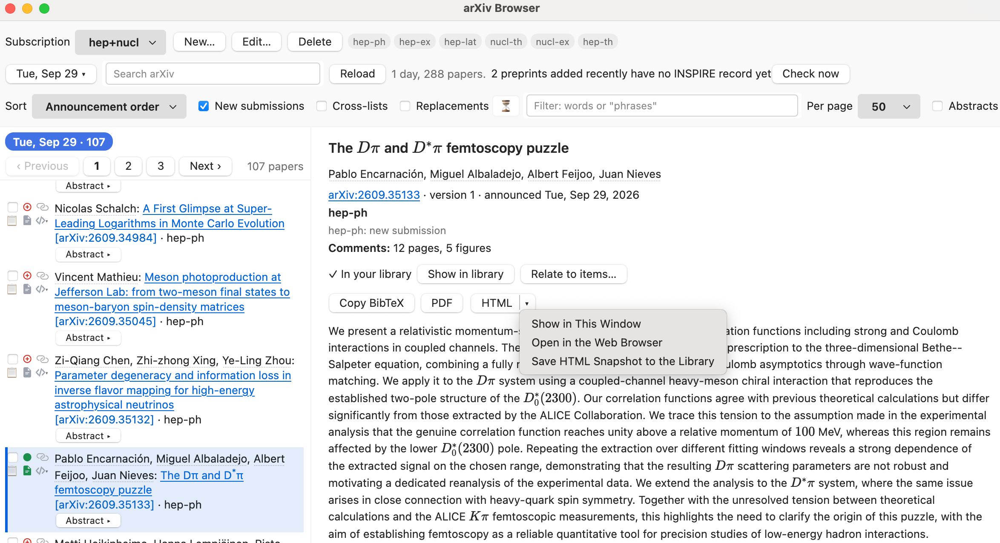
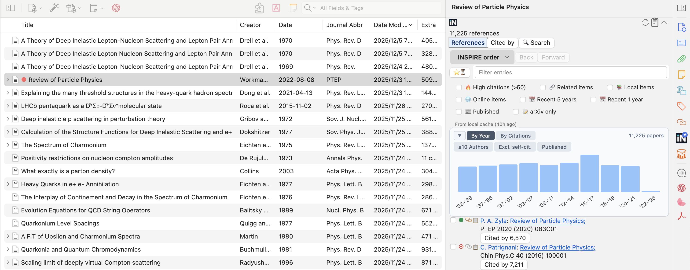
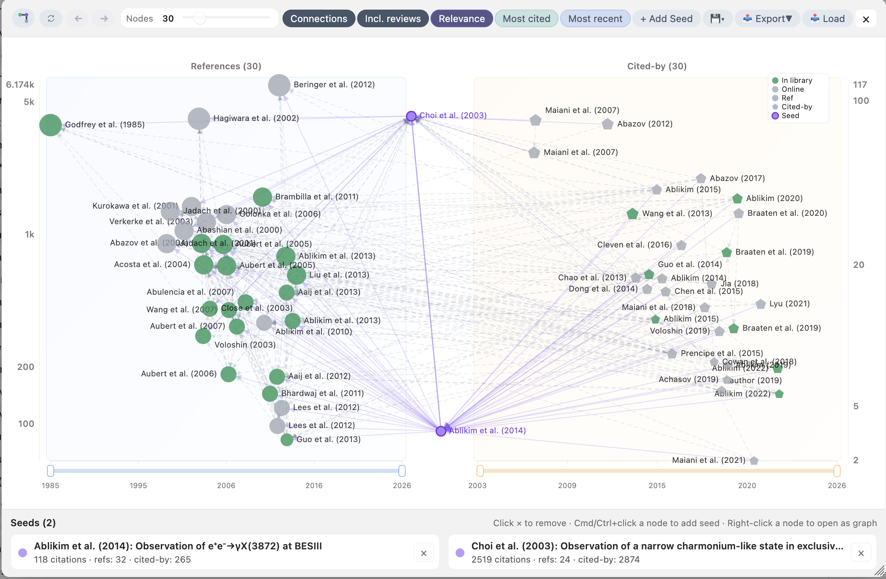
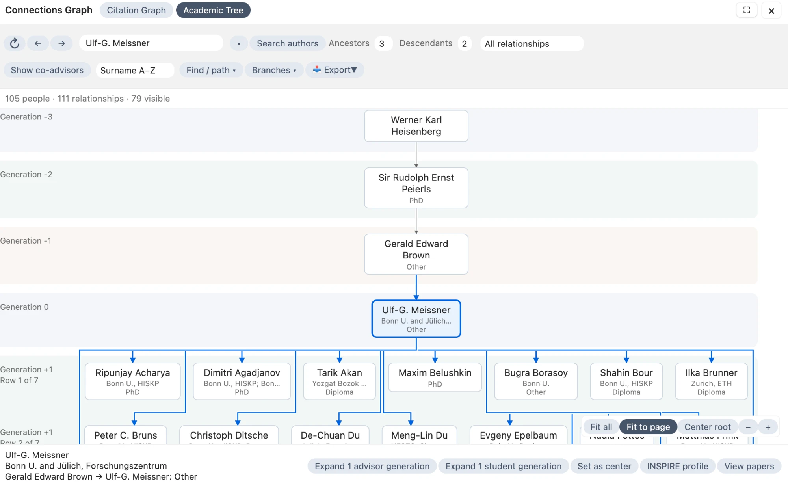

# Zotero INSPIRE 功能手册

本文档介绍 Zotero INSPIRE 插件的所有功能和使用方法。插件包含两部分：为 Zotero 量身打造的 **arXiv 浏览器**，适用于 arXiv 的全部学科；以及与 **INSPIRE-HEP** 数据库的深度集成，服务于高能物理及相关领域。

自 4.0.0 起，插件要求 **Zotero 10**；Zotero 7 至 9 的用户请使用 3.2.5 版。

## 目录

- [快速开始](#快速开始)
- [arXiv 浏览器](#arxiv-浏览器)
- [右键菜单功能](#右键菜单功能)
- [INSPIRE 引用面板](#inspire-引用面板)
- [PDF 阅读器集成](#pdf-阅读器集成)
- [预印本监控](#预印本监控)
- [偏好设置](#偏好设置)
- [使用技巧](#使用技巧)
- [故障排除](#故障排除)
- [与其他工具集成](#与其他工具集成)

---

## 截图

### arXiv 浏览器



### 文献面板



### 引用关系图



### 学术谱系



## 快速开始

### 元数据更新

右键点击 Zotero 中的条目，选择 **INSPIRE** → **Update Metadata** → **With abstracts** 即可从 INSPIRE 获取完整元数据。

更新时进度窗口一直留在前面，不会因点击别处而关闭；按 `Esc` 或右键菜单 **取消更新** 可中止，中止后提示共处理了多少条、其中多少条已更新。因网络、服务器或记录问题未得到 INSPIRE 可用答复的条目保持原样，并在提示中计数，不再被打上"无 INSPIRE 记录"标签。

### 浏览参考文献

选中一个条目后，在右侧面板找到 **INSPIRE** 区块，即可查看该论文的参考文献列表、被引论文等。

### 搜索 INSPIRE

在 Zotero 搜索栏输入 `inspire: a Witten` 并按回车，可直接搜索 INSPIRE 数据库。

### 浏览 arXiv

菜单 **查看** → **arXiv 浏览器** 打开窗口，新建订阅、选好公告日即可阅读，详见 [arXiv 浏览器](#arxiv-浏览器)。

---

## arXiv 浏览器

arXiv 浏览器是一个独立的 Zotero 窗口，用来阅读 arXiv 每天的新文列表。它不限于高能物理：数学、计算机、生物、经济等 arXiv 的任何分类都可以订阅；INSPIRE 没有收录的论文，直接按 arXiv 的数据加入文库。

**打开方式**：菜单 **查看** → **arXiv 浏览器**，或点击 Zotero 标签栏右端的 arXiv 按钮。窗口同时只开一个，再次打开会把它调到前面。也可以在偏好设置中选择启动 Zotero 时自动打开。

### 上手四步

1. **订阅**：点 **新建…**，给订阅起个名字，在分类选择器中勾选分类（可按名称或代号搜索，如 `math.AG`、`quantum`），选择要显示的栏目（新投稿、交叉列表、替换稿），保存。
2. **选日**：点日期按钮（起初显示 **最新一日 ▾**），点一个预设；或在日历上选好日子，再点 **加载**。
3. **阅读**：`j` / `k` 在论文间移动，右侧详情栏显示所选论文及其摘要；`n` / `p` 翻页。
4. **收藏与关联**：按 `a`（或 **加入…**）把论文加入文库，在保存位置选择器中选文库或分类；按 `l`（或 **关联到条目…**）把它与文库中的条目建立关联。

### 订阅与选日

- **订阅**：带名字的一组分类，用 **新建…**、**编辑…**、**删除** 管理；窗口打开时显示哪个订阅在偏好设置中选（默认第一个）。
  - 分类选择器按 arXiv 的学科组、大类、分类分层列出，带搜索框。有多个分类的大类可以整个订阅（"整个 …"），整个大类只取一页列表，不必每个分类各取一页。
  - 已选分类按你排定的顺序显示列表。
  - 编辑时会显示首次加载需要的请求数和最短时长；选了 10 个以上分类时，建议改为订阅整个大类。
- **分类标签**：订阅下方每个分类一枚标签，用来筛选列表：单击只看此分类，Ctrl/Cmd+单击增减一个，Shift+单击选一段，再单击唯一选中的那个则恢复全部。
- **日历**：可选 arXiv 近 90 天内的公告日（周一至周五）。单击选一日，Ctrl/Cmd+单击增减一日，Shift+单击选一段；点 **加载** 才开始获取，日历上注明未缓存时需要多少请求。
- **预设**（点了立即加载）：**最新一日**、**最近 5 个公告日**、**本周**、**未读的日子**。
- **未读的日子**：本订阅尚未读过的公告日带一个蓝点，从订阅建立那天算起。
  - 某日的列表完整取到并显示后，自动标为已读。
  - **标为已读** / **标为未读** 作用于所选的日子；**全部标为已读** 一次清掉所有蓝点，不需要先取列表。
  - 已读标记按订阅分别保存 100 天。

### 阅读列表

- **先到先显示**：最新一日最先获取、最先显示。订阅多个分类时，某日取到第一个分类就先显示，其余分类陆续补入（日期下方注明"仍在获取：……"）。取失败的分类可点 **重试**；中途停止的加载可点 **继续**。
- **分页**：默认每页 50 篇（**每页** 可选 10–500），用 **‹ 上一页**、页码、**下一页 ›** 翻页；列表上方的日期标签可直接跳到某一日。
- **排序**：**公告顺序**（分为新投稿、交叉列表、替换稿三栏）、**arXiv 号 ↑ / ↓**、**主分类**。**新投稿**、**交叉列表**、**替换稿** 三个勾选框决定显示哪些栏目，随订阅保存；同一篇出现在几栏时只显示一次。
- **摘要**：列表中默认折叠，点行上的 **摘要 ▸** 或按空格展开一篇，勾选 **摘要** 展开全部。公式按偏好设置中的"摘要 LaTeX"渲染。
- **详情栏**：标题、作者、arXiv 编号、版本、公告日期、分类、在哪些分类以何种栏目公告（如"hep-ph：新投稿; hep-th：交叉列表"）、备注、期刊信息、文库状态与相应操作、**复制 BibTeX**、**PDF**、**HTML**，以及摘要。列表与详情栏之间的分隔条可以拖动（获得焦点后也可用 ← / →），位置会记住。论文有多个版本时，"版本"是一个下拉选择：选较早的版本会从 arXiv 数据接口取一次，显示该版本的标题、作者、摘要与投稿日期，**PDF** 与 **HTML** 随之指向该版本。
- **过滤框**：输入词语或带引号的"短语"，在作者、标题、arXiv 编号、分类、备注、期刊信息（含 `PRL`、`PRD`、`JHEP` 等缩写）和摘要中查找；过滤历史与 INSPIRE 面板共用。
- **快速筛选（⏳）**：**本地条目**、**在线条目**、**≤10 作者**、**已发表**（有期刊信息）、**仅 arXiv**。
- **在库标记**（按 arXiv 编号在全部文库中查找，不含回收站）：● 已在文库（点击在主窗口中选中），②、③…… 文库中有多个条目，⊕ 不在文库（点击加入），? 文库读取失败（点击重试）。详情栏显示 **✓ 已在文库中** 和 **在文库中显示**。
- **PDF 按钮**：论文的条目已有 PDF 时为绿色，点击在 Zotero 中打开。论文已在文库但没有 PDF 时，与 INSPIRE 面板一样显示蓝色下载图标：点击对其条目运行 Zotero 的**查找全文**，找到 PDF 后按钮变绿（详情栏中按钮显示为**查找全文**；在那里选了较早的版本时，**PDF** 打开 arXiv 上该版本的 PDF）。论文不在文库时，点击在网页浏览器中打开 arXiv 的 PDF。
- **作者卡片**：悬停作者名。INSPIRE 收录了这篇论文、并能在其记录中认出该作者时，显示 INSPIRE 作者卡片；否则显示本地卡片。两种卡片都显示"库中 N 篇"和在 arXiv 上查找该作者的链接；INSPIRE 面板中的作者卡片也新增了这两项。

### 搜索 arXiv

在 **搜索 arXiv** 框中输入后按回车。普通词在所有字段中查找，须全部匹配；也可用 arXiv 自己的语法，例如 `au:witten`、`ti:tetraquark`、`abs:"chiral perturbation"`、`cat:hep-ph`、`AND`、`OR`、`ANDNOT`、括号、`submittedDate:[202601010000 TO 202612312359]`。

- 结果按提交时间由新到旧、按月分组，逐页获取；arXiv 最多给出前 10000 条。
- 过滤框和快速筛选同样作用于搜索结果。
- 搜索框有自己的搜索历史。
- 点 **×**，或在空的搜索框中按回车，回到原来的日期列表，页码和所在论文不变。

### 加入文库

按 `a`、点详情栏的 **加入…** 或行上的 ⊕ 加入论文。先弹出保存位置选择器（与 INSPIRE 面板同一个），选文库或分类，并可填标签和笔记。加入方式按数据自动选择：

- **INSPIRE 已收录**（有一条记录的 arXiv 编号正是这篇）：按 INSPIRE 记录导入，与从 INSPIRE 面板导入相同。
- **INSPIRE 未收录**：按 arXiv 的数据建条目，类型为 Preprint（见"未发表论文保留 Preprint 条目类型"选项），带完整作者名单，Extra 中写 `arXiv:<编号> [分类]`。
- **按期刊版本加入…**（arXiv 给出期刊信息时显示）：INSPIRE 未收录时，用 Zotero 自带的 DOI 查询取 arXiv 上给出的期刊 DOI；只有标题对得上、第一作者也对得上（arXiv 上第一作者为合作组时不比第一作者）才采用，否则按预印本加入并说明原因。
- 连不上 INSPIRE 时不加入，由你选择 **按 arXiv 数据加入** 或 **稍后再试**。

建条目前，先在目标文库中按 arXiv 编号、INSPIRE 编号和期刊 DOI 查重：已有的不再重复加入（可点 **在文库中显示**）；只有期刊 DOI 相同的，会先问你是不是同一篇。

- **PDF**：打开"添加到文库后自动'查找全文'"时，附上该论文当前版本的 arXiv PDF（标题"arXiv 预印本 PDF vN"）；另有"从 arXiv 浏览器加入的期刊条目不附 arXiv PDF"可让期刊条目不附。
- **标签**：打开"arXiv 主分类标签"时，把主分类（如 `hep-ph`、`math.AG`）加为标签。
- **批量加入**：勾选论文（`x`，Shift+单击选一段），第一个日期标题右侧出现工具条：**全选**（所有页）、**清除**、**导入**。导入沿用 INSPIRE 面板的批量导入：先查重，选一次保存位置，每篇只加入一次，按 `Esc` 取消（同时停止相应请求），最后汇总哪些没有加入。
- **补写 INSPIRE 编号**：状态栏会提示"近期加入的 N 篇预印本尚无 INSPIRE 编号"（指 30 天内加入、有 arXiv 编号而没有 INSPIRE 编号的条目）。点 **现在检查** 向 INSPIRE 查询并列出找到的记录；对你勾选的条目只写入 INSPIRE 编号、引用键（原先为空时）和被引数，不改书目信息。

### 关联到条目

按 `l`、点 **关联到条目…** 或行上的关联按钮，打开 Zotero 自带的"选择条目"对话框（限于论文所在文库），可选一个或多个条目。论文尚不在文库时先加入。关联双向一次写入，可在窗口中按 `Ctrl/Cmd+Z` 或用 **编辑** → **撤销** 撤回。不同文库中的条目不能相互关联。论文的条目已有相关条目时关联按钮为绿色，悬停列出它们；取消关联请在 Zotero 条目的"相关"栏中操作。

### 复制与链接

- **复制 BibTeX**（详情栏按钮、行上按钮、右键菜单、`Ctrl/Cmd+Shift+C`）：INSPIRE 收录时取 INSPIRE 的 BibTeX，否则取 arXiv 的。引用键：论文已在文库时用该条目的引用键，否则用 INSPIRE 的 texkey，再否则仿照 INSPIRE 生成——第一作者的姓（或合作组名）、arXiv 编号中的年份、标题中第一个实词，如 `Finkelberg:2022kostka`。提示中会说明取自哪里。
- **右键菜单**（列表与详情栏）：**复制** / **复制所选内容**、**复制为 LaTeX**（详情栏中含公式的摘要）、**全选**、**在网页浏览器中打开链接**、**复制链接地址**；在论文上另有 **复制标题**、**复制 arXiv 编号**、**复制 arXiv 页面链接**、**复制 INSPIRE 链接**、**复制 BibTeX**。
- `Ctrl/Cmd+C` 复制所选文字，每个公式只复制一次；`Ctrl/Cmd+A` 全选列表或详情栏中的文字。
- 点击标题或按回车，在网页浏览器中打开该论文的 arXiv 页面。

### HTML 版与全文快照

详情栏的 **HTML** 按钮和每行的 `</>` 按钮（列表注明 arXiv 没有 HTML 版时不显示）：已保存快照时在 Zotero 中打开快照，否则在本窗口右侧、详情栏的位置显示 arXiv 的 HTML 版。旁边的 ▾ 菜单提供 **在本窗口右侧显示**、**在浏览器中打开**、**将 HTML 快照保存到文库**、**在 Zotero 中打开快照**。

在窗口中显示时，页面沿用详情栏的宽度（拖动分隔条或放大窗口可以加宽）。点页面上方的 **‹ 详情**，或在列表中选中另一篇论文，回到详情；**在浏览器中打开** 则在网页浏览器中打开同一页面。

- 页面内的链接（章节、引用、脚注）在页面内跳转；指向别处的链接（摘要页、PDF、DOI）在网页浏览器中打开。arXiv 页面顶部的一排按钮都可用，包括目录和阅读模式。
- `Ctrl/Cmd+F` 在页面中查找：`Ctrl/Cmd+G`、`Ctrl/Cmd+Shift+G` 跳到下一处、上一处，`Esc` 关闭查找栏。查找栏是 Firefox 平台自带的，文字为英文；`ss` 与 `ß` 互不匹配。
- 焦点在页面中时，按键归页面（空格、方向键、`Ctrl/Cmd+C`、`Ctrl/Cmd+A`）。右键可复制所选文字；在链接上可打开链接或复制其地址。

保存时用 Zotero 自己的网页快照功能保存所列版本，标题为"arXiv HTML vN"，挂在论文的条目下（论文不在文库时先加入）。快照是 arXiv 全文 HTML 页面的副本，含公式和图，可在 Zotero 阅读器中阅读和批注；它和其他附件一样会同步，因此在 Zotero 手机应用中也能阅读。

### 请求间隔与缓存

- **请求间隔**：访问 arxiv.org 至少间隔 15 秒，访问 arXiv 数据接口至少间隔 3 秒；整个插件每个站点只有一条请求队列。状态栏倒数到下一次请求的时间；arXiv 要求等待（Retry-After）时，队列照办。
- **缓存**：每个分类每天的列表保存 100 天。最新一期和近几个公告日的索引一直沿用到下一次预定公告（纽约时间周日至周四 20:00），所以重开窗口不发请求。**重新加载** 会重新获取最新一期。
- 关闭窗口会取消它尚未发出的请求。
- 在窗口中显示的 HTML 页面在点击时立即加载，与网页浏览器打开它一样，不经过上述队列。

---

## 右键菜单功能

在 Zotero 中右键点击条目或合集，选择 **INSPIRE** 子菜单访问以下功能：

### 条目菜单

| 功能组         | 选项                         | 描述                                                          |
| -------------- | ---------------------------- | ------------------------------------------------------------- |
| **更新元数据** | With abstracts               | 获取全部元数据，包括摘要                                      |
|                | Without abstracts            | 获取元数据但不更新摘要字段                                    |
|                | Citation counts only         | 只更新引用数（含/不含自引），无 INSPIRE 记录时回退到 CrossRef |
| **缓存**       | Download references cache    | 预先下载参考文献缓存，支持离线浏览                            |
| **复制**       | Copy BibTeX                  | 从 INSPIRE 获取并复制 BibTeX                                  |
|                | Copy citation key            | 复制条目的 Citation Key                                       |
|                | Copy INSPIRE recid           | 复制 INSPIRE 记录 ID                                          |
|                | Copy INSPIRE link            | 复制 INSPIRE 文献链接                                         |
|                | Copy INSPIRE link (Markdown) | 复制 Markdown 格式链接                                        |
|                | Copy Zotero link             | 复制 Zotero 选择链接                                          |
|                | Copy Funding Info            | 从 PDF 致谢部分提取并复制资助信息                             |
| **合作组标签** | Add Collaboration Tags       | 为大型合作组论文添加合作组标签                                |
| **预印本**     | Check Preprint Status        | 检查预印本是否已正式发表                                      |
| **操作**       | Cancel update                | 取消正在进行的更新操作                                        |
| **收藏**       | Toggle Favorite Paper        | 切换当前条目的收藏状态                                        |

### 合集菜单

| 功能组         | 选项                           | 描述                           |
| -------------- | ------------------------------ | ------------------------------ |
| **更新元数据** | With abstracts                 | 获取全部元数据，包括摘要       |
|                | Without abstracts              | 获取元数据但不更新摘要字段     |
|                | Citation counts only           | 只更新引用数                   |
| **缓存**       | Download references cache      | 预先下载参考文献缓存           |
| **预印本**     | Check Preprints in Collection  | 检查合集中的预印本是否已发表   |
|                | Check All Preprints in Library | 检查整个库中的所有预印本       |
| **合作组标签** | Reapply Collaboration Tags     | 重新应用合作组标签到合集中条目 |
| **操作**       | Cancel update                  | 取消正在进行的更新操作         |

---

## INSPIRE 引用面板

在条目详情面板中，INSPIRE 插件添加了一个专用面板。

### 标签页

| 标签页            | 功能描述                                                        |
| ----------------- | --------------------------------------------------------------- |
| **References**    | 显示当前文献的参考文献列表                                      |
| **Cited by**      | 显示引用当前文献的所有论文                                      |
| **Related**       | 基于混合相似度（共享参考文献 + 共引）推荐相关论文（相关性排序） |
| **Entry Cited**   | 查看某条参考文献的被引记录（点击引用数）                        |
| **Author Papers** | 查看某位作者的所有论文（点击作者名）                            |
| **🔍 Search**     | INSPIRE 搜索结果                                                |
| **⭐ Favorites**  | 收藏的作者和论文                                                |

### Related（相关论文推荐）

**Related** 标签页会基于当前论文的参考文献，采用“共享参考文献 + 共引（co-citation）”的混合算法推荐可能相关的论文：

- **阶段 1：书目耦合（shared references）**：从当前论文的参考文献中选取一组“锚点参考文献”，抓取引用这些锚点的论文作为候选，并按共享锚点（带权重）聚合得到 `couplingScore`。
- **阶段 2：共引重排（co-citation）**：对 top `T=25` 的候选，查询“同时引用 seed 与 candidate”的论文数 `co`，并计算 `coCitationScore = co / sqrt(seedCites * candCites)`（归一化余弦相似度，截断到 `[0,1]`）。共引权重 `α` 随 seed 被引数 sigmoid 增长，上限 50%（`seedCites < 5` 时 `α=0`）。
- **最终得分**：`combinedScore = (1-α) * couplingScore + α * coCitationScore`。其中 anchor 权重实现为 `w_r = 1 / (1 + log1p(c_r))`（高被引、过于通用的参考文献贡献更小）。
- **默认过滤**：默认会避开 PDG 的 _Review of Particle Physics_（过于通用，容易破坏相关性），并可在偏好设置中选择是否排除综述类文章。
- **缓存**：推荐结果会写入本地缓存，便于重复打开时快速加载。

### Academic Tree（学术谱系）

卡片按姓名与当前机构自适应宽高，保持姓名 13px 字号。展开后中心人物仍位于其直接学生组的中点上方，单一导师链竖直对齐；中心人物也参与其导师的学生排序，排序时保持上述竖直对齐。共同导师就近插入。折线避开卡片，多导师的箭头分别进入学生卡片，交叉处留出细窄间隔；悬浮连线可突出该关系及两端人物。年份模式使用与师生关系中学位类型对应的教育经历结束年份，不将其宣称为独立核实的获学位日期。

通过作者预览卡或 Author Papers 页面中的 **学术谱系** 按钮打开，也可在关系图（Connections Graph）浮窗顶部切换到 **Academic Tree** 并搜索作者。

- **刷新 INSPIRE**：绕过缓存重新获取当前谱系及已展开分支的数据；加载期间或刷新失败时保留原图，并保留代数、筛选与视图位置。失败后显示“重试”，手动停止后显示“继续加载”，两者均复用已成功取得的数据。
- **当前机构**：姓名下方显示 INSPIRE 明确标记为当前的机构；历史机构或缺失信息不显示。长机构名称缩略显示，悬浮可查看全文。
- **多代师承**：上溯可选 0–10 代，下溯可选 0–8 代，默认各 2 代；0 表示隐藏该方向。分支展开也遵守上溯十代、下溯八代边界，点击边界人物的姓名可换为新中心继续追溯。
- **搜索记忆**：作者搜索框旁的 ▾ 可查看、重搜和清空历史；输入末尾按 Tab 或右方向键接受补全，下方向键打开历史。记录在重开窗口或重启 Zotero 后保留，与侧边栏论文搜索分开保存，复用其保留期限设置（默认 30 天、最多 50 条）。偏好设置中的清除历史会同时清除两处记录。
- **姓名导航**：点击人物姓名，以其为中心继续追溯，同时在侧边栏显示该作者页面；小窗保持打开。悬浮姓名显示与侧边栏相同的作者预览卡。
- **前进／后退**：在已浏览作者之间切换，同时恢复展开分支、代数与类型筛选、选中人物及画布位置，并同步侧边栏作者页面。保留最多 20 条历史；后退后选择新作者会清空前进记录。
- **分支操作**：点击卡片空白处选择人物，可单独展开一代导师或一代学生、设为中心、查看论文或打开 INSPIRE 作者页面。
- **分支阅读**：卡片姓名水平、垂直居中；若全名末尾会被省略，则保留第一个名字完整、其余名字改用首字母，并保留完整姓氏；必要时仅将该卡片小幅加宽。导师与学生分支对齐排布，减少连线交叉。悬浮、键盘聚焦或选中卡片时，相关连线以蓝色突出显示；其他关系保留可见。
- **直接学生层级**：只要人物与中心作者存在直接师生记录，就固定显示在第 +1 代。若另一位已显示的学生也是其导师，该关系仍显示为同代连接，不会将这位直接学生下推到第 +2 代。
- **组内排序**：同一导师在同一代的所有学生统一排序，无论学生是否还有其他导师。默认按 INSPIRE 规范姓名的姓氏 A–Z 排序，也可选择“教育年份 ↑”。年份按这条师生关系的学位类型，读取可唯一对应的已完成教育经历结束日期；未知年份排末尾，同年按姓氏排序。若交叠师生组的年份顺序相互矛盾，优先满足离中心人物最近的导师。卡片悬浮说明年份来源；导航历史及导出保留排序方式。
- **共享作者数据**：侧边栏、悬浮卡与谱系共用作者 profile 和缓存，保留规范姓名及公开教育经历；同一作者的并发请求合并，旧缓存缺少字段时按需更新。
- **关系类型**：保留共同导师及同一对人物的多种培养关系，可筛选七种原始类型、未注明或所有已注明学位／资格。箭头从导师指向学生。
- **人物背景**：补充共同导师使用极浅灰底和较弱边框，姓名保持清晰；普通人物保持默认背景，中心与选中人物优先使用蓝色强调。灰底分类与共同导师开关一致，兼容深色模式和图像导出。
- **共同导师开关**：默认隐藏补充的共同导师，顶部胶囊按钮可切换显示，同时保留中心人物自己的导师和已展开的祖先学生分支。**查找 / 路径**：在已加载谱系中按姓名、INSPIRE ID 或单位查找并定位，不更换中心、不请求网络。选择两个人物可高亮最短师承连接路径并自动缩放到该路径；每段箭头保持原方向，也可展示经共同导师连接的路径。
- **连线**：主线分叉点可不等距，优先对准可用空隙。跨排连线先减少转折，再缩短距离；单导师箭头可在顶部小幅偏离中心接入，避免末端小折角。共同导师箭头仍分开显示；正上方导师与学生对齐且中间无阻挡时，保留中央接入点，避免为了分开箭头产生小折角。
- **关系类型标签**：姓名和机构下方显示当前可见导师对应的关系类型，不表示人物的最高学位。PhD、Diploma、Bachelor、Master、Habilitation、Laurea、Other 和未注明分别保留；悬浮标签查看具体师生关系。隐藏共同导师也会移除其对应类型。可单独筛选各类型，“已注明学位／资格”包含前六种；Other 与未注明均不推断为博士后指导。图像导出保留标签。
- **代际背景**：普通树形和页面内排布共用极浅背景带，颜色表示画布层级，不代表唯一的学术辈分。共同导师跨层时，学生仍放在所有导师下方，较高层导师的连线可以跨层。
- **页面内排布**：位于“适应全图、中心人物居中、−／＋”同组控件中。按窗口宽度将过长的一代分成多排，保持正常姓名字号；用极浅的代际背景带、代数与排数标记区分换排和师生代际；同一代换排后保持同色。从左到右、再到下一排阅读，滚轮或拖动可纵向浏览，Ctrl/⌘＋滚轮可缩放。改变窗口宽度会重新分排。关闭按钮恢复树形排布；“适应全图”仍通过缩放显示全图。导航历史及图像／JSON 导出保留此模式。
- **分支菜单**：“展开所有已显示祖先的学生”覆盖点击时已经显示的所有祖先代数；每位祖先仅加载其直接学生，本次新出现的人物不继续递归展开，并遵守既有人数和请求上限。展开后同一按钮切换为“收起新增的祖先学生分支”，保留原有谱系；再次展开直接恢复已加载分支，无需重新请求。可收起所选人物的学生分支、恢复单个分支或恢复全部分支，无需重复请求。共享学生若还有其他可见连接则保留；中心人物的祖先链不允许收起。定位隐藏人物或显示隐藏路径会恢复所需显示。
- **📤 导出▼**：与 Citation Graph 共用弹出菜单和文件保存功能，支持 SVG、PNG、JSON、CSV，可选当前视图或全部已加载谱系。SVG/PNG 始终导出所选范围的完整排布：“当前视图”包含当前显示的全部人物，即使有些位于窗口外；“全部已加载谱系”还包含已隐藏分支。JSON/CSV 导出可见或全部已加载人物与关系。JSON 同时记录 ID、筛选、收起与路径状态、视口；CSV 区分人物行与关系行。完整导出不额外联网。图像采用浅色主题；PNG 限制单边 8192 像素、约 1600 万像素，大型谱系推荐 SVG。

- **画布操作**：拖动平移、滚轮缩放；支持适应全图、定位中心作者、调整窗口大小及最大化。键盘方向键移动，+/− 缩放，0 适应全图。
- **按需加载**：逐层显示结果，随时可以停止。默认节点预算为 200，可通过“加载更多”提高到最多 1000；大谱系可选取分支继续查看。
- **数据范围**：师承来自 INSPIRE 公开作者记录，按作者 ID 合并人物；只有姓名、没有作者链接的记录以虚线卡片显示，不自动匹配同名人物。未找到记录不代表不存在师承关系，失败分支可重试。

### Citation Graph（引用图）

**Citation Graph** 提供 1-hop 的引用关系可视化：左侧为 References，右侧为 Cited-by，中间为 Seeds（支持多 seed 合并）。

- **打开方式**：面板工具栏按钮（以当前条目为 seed）；主工具栏搜索框旁的按钮（无 seed 时可在空画布中添加）；右键菜单可打开 Combined Citation Graph（多 seed）。
- **交互**：单击节点（若已在库中则可跳转）；右键节点可重置 seed；Cmd/Ctrl+单击节点可添加为 seed；拖拽平移；Cmd/Ctrl+滚轮缩放。
- **时间窗口**：每侧 x 轴下方都有时间范围 slider（左右独立），可缩放时间窗口，窗口外节点会隐藏以减少拥挤。
- **综述开关**：Incl./Excl. reviews 可控制是否纳入综述文章（包括 PDG RPP）。

### INSPIRE 搜索

有两种方式搜索 INSPIRE：

**方式一：从 Zotero 搜索栏**

1. 在 Zotero 主窗口搜索栏输入 `inspire:` 前缀，后跟搜索词
2. 按 Enter 执行搜索
3. 结果显示在面板的 Search 标签页中

**方式二：从面板搜索框**

1. 点击面板的 **🔍 Search** 标签页
2. 在搜索框中直接输入 INSPIRE 搜索语法（无需 `inspire:` 前缀）
3. 按 Enter 或点击搜索按钮执行搜索

**搜索语法示例**：

| 语法                      | 说明                            |
| ------------------------- | ------------------------------- |
| `a S Weinberg`            | 搜索作者名为 S. Weinberg 的论文 |
| `t quark mass`            | 搜索标题包含 quark mass 的论文  |
| `arXiv:2305.12345`        | 搜索特定 arXiv 编号             |
| `j Phys.Rev.D`            | 搜索发表在 Phys.Rev.D 的论文    |
| `a Weinberg and t chiral` | 组合搜索：作者 + 标题关键词     |
| `topcite 100+`            | 搜索引用数超过 100 的论文       |
| `eprint hep-ph`           | 搜索 hep-ph 分类的预印本        |

搜索历史会自动保存，可通过下拉菜单快速访问最近的搜索。

### 统计图表

在 References、Cited by 和 Author Papers 标签页中，面板顶部显示统计图表：

- **两种视图**：按年份分布 / 按引用数分布
- **交互筛选**：点击柱状图筛选条目，Ctrl/Cmd+点击多选, 按住Shift点击选择区间
- **折叠/展开**：点击按钮收起图表节省空间
- **作者数过滤**：点击"≤10 Authors"排除大型合作组论文
- **非自引过滤**：点击"Excl. self-cit."排除自引（By citations 视图以及作者 profile）
- **Published 过滤**：点击"Published"仅显示正式发表的论文

### 搜索与过滤

- **多词搜索**：输入多个词，所有词必须匹配
- **短语搜索**：用双引号包裹文本精确匹配，如 `"Phys Rev Lett"`
- **期刊缩写**：支持 `"PRL"`、`"JHEP"`、`"PRD"` 等常见缩写
- **特殊字符**：自动处理 ä→ae 等转换
- **排序**：原始顺序 / 最新优先 / 最多引用优先
- **快速筛选**：点击 Filters 按钮使用预设（高引用、关联条目、本地条目、已发表等）

### 状态指示

| 图标      | 含义                   |
| --------- | ---------------------- |
| ● (绿色)  | 本地库中已有此条目     |
| ②、③…     | 库中有多个条目对应此文 |
| ⊕ (红色)  | 可点击添加到库         |
| ?         | 文库读取失败，点击重试 |
| 🔗 (绿色) | 已关联为相关条目       |
| 🔗 (灰色) | 未关联                 |
| 📄 (绿色) | 有 PDF 附件 - 点击打开 |
| ⬇️ (蓝色) | 可查找全文             |
| 📄 (灰色) | 无 PDF / 未在库中      |
| 📋        | 复制 BibTeX            |
| T         | 复制 TeX Key           |

### 交互操作

| 操作              | 效果                                             |
| ----------------- | ------------------------------------------------ |
| 点击绿色圆点      | 跳转到本地条目                                   |
| 双击绿色圆点      | 直接打开 PDF                                     |
| 点击红色圆点      | 打开导入对话框                                   |
| 点击链接图标      | 关联/取消关联为相关条目（可用"编辑 → 撤销"撤回） |
| 点击绿色 PDF 图标 | 打开 PDF 附件                                    |
| 点击蓝色下载图标  | 触发查找全文功能                                 |
| 点击剪贴板图标    | 复制 BibTeX 到剪贴板                             |
| 点击 T 按钮       | 复制 TeX Key 到剪贴板                            |
| 点击引用数        | 查看该条目的被引记录                             |
| 点击标题          | 在浏览器中打开 INSPIRE 页面                      |
| 悬停标题          | 显示摘要                                         |
| 点击作者名        | 查看该作者的所有论文                             |
| 悬停作者名        | 显示作者资料卡片                                 |
| 右键点击条目      | 显示收藏/取消收藏菜单                            |

### 收藏功能

**⭐ Favorites 标签页**可以快速访问您收藏的作者、论文和学术报告：

- **收藏作者**：在 Author Papers 标签页中点击星形按钮（☆/★），或在作者预览卡片中点击星形按钮
- **收藏论文与报告**：在 INSPIRE 面板中右键点击任意条目，选择"收藏论文"（或"收藏报告"），或在 Zotero 主窗口的右键菜单中操作。类型为 "Presentation" 的条目会自动分类到 "Favorite Presentations" 一栏。
- **快速访问**：所有收藏内容显示在 Favorites 标签页中（分为作者、论文、报告三类），支持各分类内拖拽排序
- **筛选**：使用文本筛选框在收藏列表中搜索

### 作者资料卡片

悬停在作者名称上时，会显示作者资料预览卡片：

| 内容           | 说明                                       |
| -------------- | ------------------------------------------ |
| **姓名与 BAI** | 显示全名及 INSPIRE 作者标识符 (BAI)        |
| **当前职位**   | 所属机构和职位（如有）                     |
| **研究领域**   | arXiv 分类（如 hep-ph, nucl-th）           |
| **快捷链接**   | 📧 Email、🆔 ORCID、🔗 INSPIRE、🌐 主页    |
| **库中篇数**   | 该作者在你文库中的论文数                   |
| **arXiv 查找** | 在 arXiv 上查找该作者的论文                |
| **查看论文**   | 点击"View Papers"跳转到 Author Papers 标签 |

**交互方式**：

- 悬停后延迟 300ms 显示
- 鼠标移开后延迟 600ms 隐藏
- 点击链接可发送邮件、打开 ORCID/INSPIRE 页面
- 右键点击链接可复制（邮箱地址、ORCID）

### 键盘导航

| 按键             | 功能                           |
| ---------------- | ------------------------------ |
| ↑ / k            | 导航到上一条目                 |
| ↓ / j            | 导航到下一条目                 |
| ←                | 后退                           |
| →                | 前进                           |
| Home / End       | 跳转到列表首/尾                |
| Enter            | 打开 PDF / 选中条目 / 触发导入 |
| Space / l        | 切换关联状态                   |
| Tab / Shift+Tab  | 切换标签页                     |
| Ctrl/Cmd+Shift+C | 复制当前条目的 BibTeX          |
| Escape           | 清除焦点                       |

**arXiv 浏览器窗口**中的按键作用于当前论文，在输入框中打字时不起作用：

| 按键                         | 功能                                    |
| ---------------------------- | --------------------------------------- |
| j / ↓，k / ↑                 | 下一篇 / 上一篇（到页尾自动进入下一页） |
| n / p                        | 下一页 / 上一页                         |
| Home / End                   | 本页第一篇 / 最后一篇                   |
| Space                        | 展开或折叠摘要                          |
| Enter                        | 在网页浏览器中打开 arXiv 页面           |
| a                            | 加入文库（弹出保存位置选择器）          |
| l                            | 关联到条目（"选择条目"对话框）          |
| x                            | 勾选或取消勾选，用于批量加入            |
| Esc                          | 清除焦点；关闭日历或查找栏              |
| Ctrl/Cmd+F                   | 在窗口中显示的 HTML 页面里查找          |
| Ctrl/Cmd+G，Ctrl/Cmd+Shift+G | HTML 页面中的下一处 / 上一处匹配        |
| Ctrl/Cmd+Shift+C             | 复制 BibTeX                             |
| Ctrl/Cmd+C                   | 复制所选文字（每个公式只复制一次）      |
| Ctrl/Cmd+A                   | 全选列表或详情栏中的文字                |
| Ctrl/Cmd+Z，Ctrl/Cmd+Shift+Z | 撤销 / 重做（包括在窗口中建立的关联）   |
| Ctrl/Cmd+W                   | 关闭窗口                                |
| 分隔条上的 ← / →             | 移动分隔条                              |

### 导入对话框

- **标签和备注**：可选择预填标签和备注
- **拖拽调整**：窗口可拖拽标题栏移动，可拖拽边缘调整大小
- **筛选功能**：支持按名称筛选样式和文件夹

### 批量导入

- **复选框选择**：条目左侧显示复选框，支持单选、Shift+Click 范围选择、Ctrl/Cmd+Click 多选
- **批量工具栏**：选中条目后显示"Select All"、"Clear"、"Import"按钮
- **重复检测**：导入前自动检测本地库中的重复条目；对话框注明每篇命中几个条目，涉及群组文库时注明所在文库
- **每篇一次**：同一篇论文出现在多行时只导入一次，结果同步到所有这些行
- **批量导入**：一次性选择目标库/文件夹/标签，显示进度，支持 ESC 取消；取消时正在进行的请求一并停止

### 导出功能

点击工具栏的导出按钮，打开导出菜单：

| 导出选项                     | 说明                                                                                               |
| ---------------------------- | -------------------------------------------------------------------------------------------------- |
| **Copy to Clipboard**        | 复制 BibTeX / LaTeX (US) / LaTeX (EU) 格式到剪贴板                                                 |
| **Copy citation keys**       | 复制选中条目的 INSPIRE citation keys（texkeys），以逗号分隔，方便直接粘贴到 LaTeX `\cite{}` 命令中 |
| **Export to File**           | 导出为 `.bib` 或 `.tex` 文件，适用于超过剪贴板限制的大型参考文献列表                               |
| **Select Citation Style...** | 选择 Zotero 引用样式导出，可选择目标位置和格式                                                     |

**Select Citation Style... 功能**：

点击此选项后会弹出样式选择器：

1. **样式选择**：从 Zotero 已安装的引用样式中选择（如 APS、Chicago、Nature 等）
2. **目标选择**：若所选条目未在Zotero 库中，会自动调出选择窗口添加到库

**Citation keys 获取策略**（按优先级）：

1. 从面板数据中获取已缓存的 texkey
2. 从 Zotero 本地库对应条目的 citationKey 字段获取（避免网络请求）
3. 从 INSPIRE API 获取（仅当前两项都不可用时）

**智能选择检测**：如果使用复选框选中了条目，导出菜单会显示选中数量，仅导出选中条目；否则导出所有可见条目。

### 本地缓存

- References、Cited By 和 Author Papers 数据会保存到本地磁盘
- References 永久有效；Cited By / Author Papers 默认 24 小时过期
- 支持 gzip 压缩，磁盘占用可降低约 80%
- 右键菜单可预先下载缓存，适合出差或无网环境

### INSPIRE 请求限速

插件的全部 INSPIRE 请求共用一个限速：任意 5 秒内至多发出 12 个（INSPIRE 自己的上限是 15 个），你发起的请求优先于启动时的后台预印本检查。遇到 429 时按服务器要求等待（至少 5 秒）后重试，最多 3 次（供外部工具调用的 BibTeX 接口不重试，直接返回限速错误）。有请求排队时，面板工具栏显示 **🚦 INSPIRE 排队 N**。

### 导航历史

- **Back/Forward 按钮**：工具栏提供 ← → 按钮，可在浏览过的条目间导航，类似浏览器历史
- **自动恢复**：可选择在返回时自动重新打开已关闭的 PDF 阅读器标签页

---

## PDF 阅读器集成

在 Zotero PDF 阅读器中选中包含引用标记的文本时，插件会自动识别并提供查找按钮。

### 引用识别

1. 在 PDF 中选中包含引用的文本（如"see Refs. [1,2,3]"）
2. 检测到引用后，弹出菜单显示"INSPIRE Refs. [n]"按钮
3. 选中多个引用时，显示多个按钮

### 支持的引用格式

| 格式      | 示例               |
| --------- | ------------------ |
| 单个数字  | [1], [42]          |
| 多个数字  | [1,2,3], [1, 2, 3] |
| 数字范围  | [1-5], [1–5]       |
| 混合格式  | [1,3-5,7]          |
| 作者-年份 | [Smith 2024]       |
| 上标数字  | ¹²³⁴⁵⁶⁷⁸⁹⁰         |

### 悬浮预览

悬浮在查找按钮上可预览条目详情（标题、作者、摘要、出版信息等）。若大型 References 列表尚未载入内存，Zotero 10 上可先显示 marker-local 的原生参考文献文本，避免为一次悬浮解压整份缓存；文档级 `citation` overlay 必须先经缓存列表佐证。

- 状态按钮：点击“本地库中”可在 Zotero 中定位该条目；点击“在线”可在浏览器中打开该条目页面（优先 INSPIRE）
- 常用操作：导入、打开 PDF（如有）、关联/取消关联、复制 BibTeX/texkey、收藏

### 面板联动

点击查找按钮后：

1. 自动切换到 References 标签页
2. 高亮显示对应条目
3. 滚动到该条目位置

### Zotero 10 原生结果复用

在经过源码审计的 Zotero 10.0 构建上，插件首先复用 Zotero 已经完成的引用分析，而不会在条目选择或 Reader 打开时再启动第二次 PDF worker 处理。打开 Reader、渲染工具栏或启动插件时也不再预先扫描全篇原生 overlay；Zotero 在库条目侧栏中创建的内嵌 PDF Preview 同样不会借 `renderToolbar` 触发预热。该全局兼容索引只在用户真正进行 Reader 文本选择或引用交互后才允许构建。插件优先使用 Zotero 自己解析出的引用文本：`internal-link` 目标是当前 marker 的局部证据，可以直接显示；`citation` overlay 则是 Zotero 的文档级数字匹配，必须先用缓存列表确认编号没有在其他章节重复。若只有 `internal-link` 目标，则在用户选中文献编号、lookup 控件出现后，对于超过整篇 overlay 生产边界的超大 PDF（例如多千页的 _Review of Particle Physics_），也只按需读取目标参考文献所在的一页。匹配不再把章节内会重复的 `[27]` 当成全局身份，而只接受 arXiv、DOI，或期刊/卷/页与作者信息构成的唯一强匹配；旧解析器识别出的相邻多篇组合引用仍可定位，而同一编号出现在相互分离的章节区段时会拒绝猜测。

References 区段收起时的普通条目选择，以及单纯打开 PDF，本身不会解压 References 缓存，也不会解析 `.zotero-ft-cache`。`onItemChange` 只同步当前条目状态；仅当 References section 真正展开或用户点击 lookup 时，才完整读取已有列表缓存。对于尚未载入列表的首次悬浮，marker-local 的 `internal-link` 目标可以直接显示而不解压大型 gzip；文档级 `citation` overlay 则会先读取缓存列表确认该编号唯一，再显示完整 INSPIRE 条目卡。若兼容 Reader 完全没有提供原生结果，或链接目标没有可提取文字（例如版本不支持、标记不是数字、目标页为扫描图像，或选择处没有相交 overlay），插件仍保留历史缓存列表兜底，因此这一路径的首次悬浮可能读取冷缓存；若原生目标存在但证据歧义，或在悬浮预算内超时，则冷悬浮不显示卡片，直到列表已在内存中或用户点击 lookup 后才进入历史匹配链。原生结果是高置信度捷径，不是兼容性门槛：点击时严格匹配失败或不可用，插件仍会复用以前持久化的 attachment 映射，并保留完整的 PDF 解析与多轮匹配链作为兜底。

当悬浮需要转入历史 matcher 时，它会先恢复与点击相同的轻量持久化 attachment 映射，避免同一 marker 的悬浮卡与点击定位不一致。在列表和映射均未载入时，可无歧义地把六位 `125130` 恢复为 `125–130`；四位 token 则先保留原值，避免把综述中的真实编号 `1234` 错拆。第一次真正悬浮或点击取得上界后，只有所有缓存条目都带编号的章节重置列表才使用最大实际编号把 `6264` 恢复为 `62–64`；只要存在无编号条目，就改用“最大实际编号与完整列表长度中的较大者”，保护真实的尾部编号。等宽端点继续沿用原有跨度限制；不等宽恢复只允许 `912` → `9–12` 这类跨十进制位数边界的短范围，避免把真实高编号 `725` 错拆成 `7–25`。标签覆盖率直接复用 matcher 建索引时已有的统计，不再额外扫描整份列表生成诊断对象。持久化 PDF 映射只能进一步提高该上界。

该功能默认启用，可在“PDF 引用检测设置”中关闭；设置在重启 Zotero 后生效。

### 模糊检测（实验性）

当 PDF 文本层有问题时，可在偏好设置中启用"Fuzzy citation detection"，识别缺少方括号的引用模式。

---

## 预印本监控

检测 Zotero 库中未发表的 arXiv 预印本，并检查它们是否已正式发表。

### 使用方法

1. **条目菜单**：右键选中条目 → INSPIRE → Check Preprint Status
2. **合集菜单**：右键合集 → INSPIRE → Check Preprints in Collection
3. **合集菜单**：右键合集 → INSPIRE → Check All Preprints in Library（我的文库与所有可编辑的群组文库）

### 检查流程

1. 扫描选中条目（或合集、全部可编辑文库），识别未发表的预印本；每次检查都重新扫描
2. 按 arXiv 编号向 INSPIRE 查询发表状态，每次请求查 50 篇（例如 883 篇预印本约需 18 次请求）。手动检查每篇都查；启动时的后台检查只跳过 7 天内 INSPIRE 答复无记录的论文，且让位于你发起的请求；手动检查开始时停止正在进行的后台检查
3. 只有记录中的 arXiv 编号正是该条目的编号才算数；记录的标题或第一作者与条目不符（且条目尚未写入该记录的编号）时，以"可能是另一篇论文"提示，且默认不勾选
4. 每篇的结果为四种之一：已发表、未发表（INSPIRE 有记录但无期刊发表）、INSPIRE 未覆盖（无记录）、查询出错；查询出错不记入缓存，也不覆盖此前的答复
5. 显示结果对话框，列出已发表的论文及四种结果的篇数；另列出"INSPIRE 已收录、尚未发表"而条目尚无 INSPIRE 编号的预印本。两类都没有时只以通知显示篇数
6. 选择要更新的条目，点击确认：已发表的更新书目信息；尚未发表的只写入 INSPIRE 编号、引用键（原先为空时）和被引数，不改书目信息

### 更新内容

- DOI：从 arXiv DOI 更新为期刊 DOI
- 期刊信息
- 日期：更新为正式发表日期
- 保留原 arXiv 信息在 Extra 字段中

---

## 偏好设置

通过 **工具** → **插件** → **INSPIRE Metadata Updater** → **首选项** 访问。

### 新条目自动获取

| 选项     | 说明                           |
| -------- | ------------------------------ |
| 含摘要   | 添加新条目时自动获取完整元数据 |
| 不含摘要 | 获取元数据但不含摘要           |
| 仅引用数 | 只获取引用数                   |
| 禁用     | 不自动获取                     |

### Citation Key 设置

- **使用 INSPIRE 引用键**：将 INSPIRE 的 texkey 写入 Citation Key 字段
- **禁用**：不设置 INSPIRE 格式的 Citation Key

### Extra 字段顺序

- **引用优先**：引用数显示在 Extra 字段顶部
- **arXiv 优先**：arXiv ID 显示在顶部

### 主列表自定义列（Cites / arXiv）

在 Zotero 主列表（条目列表）中可启用两列：

- **Cites**：显示 INSPIRE 引用数（来自插件写入 Extra 的 `X citations ...` 行；默认含自引，可配置为不含自引）
- **arXiv**：显示 arXiv 号（本地提取：Journal Abbr. / Extra / URL / DOI；排序会对旧式 `hep-th/9802109` 等按数字部分规范化）

启用方式：在条目列表表头打开列选择器，勾选 `Cites` / `arXiv`。

相关选项：

- **Cites 列：不含自引**：切换显示含/不含自引的引用数；若主列表未刷新，可切换集合或重启 Zotero。
- **（兼容）将 arXiv 号写入 Journal Abbr.**：默认关闭（已有 arXiv 列后不再推荐写入 Journal Abbr.，仅用于向后兼容）。

### arXiv 分类标签

启用后，自动将 arXiv 主分类（如 hep-ph、nucl-th）添加为标签。

### 引用面板设置

- **最大显示作者数**：设置显示多少位作者后显示"et al."
- **启用统计图表**：在面板顶部显示统计图表
- **图表默认折叠**：打开面板时图表是否默认折叠

### 本地缓存设置

- **启用本地缓存**：总开关
- **显示缓存来源指示器**：在状态栏显示数据来源
- **缓存 TTL**：Cited by 和 Author Papers 的缓存有效期
- **压缩缓存文件**：使用 gzip 压缩
- **自定义缓存目录**：设置缓存存储位置
- **清除缓存**：一键删除所有缓存文件

### PDF 引用检测设置

- **模糊引用检测**：识别缺少方括号的引用（实验性）
- **解析 PDF 参考文献列表**：提高引用匹配准确度
- **复用 Zotero 10 引用分析结果**：后台复用已完成的 Zotero 10.0 结果；关闭或开启后需重启 Zotero

### 摘要 LaTeX 模式

- **KaTeX（默认）**：使用 KaTeX 渲染复杂 LaTeX 公式（分数、积分、矩阵等）
- **Unicode**：使用 Unicode 字符渲染简单公式，轻量快速

### 摘要复制

悬停显示摘要时，右键点击可：

- **Copy** / **Copy Selection**：复制纯文本摘要
- **Copy as LaTeX**：复制原始 LaTeX 源代码

### 预印本监控设置

- **启用预印本监控**：总开关
- **启动时自动检查**：每天首次启动时检查一次
- **发现已发表时显示通知**：后台检查发现时显示桌面通知

### arXiv 浏览器设置

| 选项                                        | 说明                                                         |
| ------------------------------------------- | ------------------------------------------------------------ |
| 打开时的订阅                                | 窗口打开时显示的订阅（默认第一个订阅）                       |
| 打开时显示                                  | 最新一日（默认）、最近 5 个公告日或本周                      |
| 在列表中显示摘要                            | 默认关闭：列表中摘要折叠，所选论文的摘要在详情栏中           |
| 每页篇数                                    | 10 至 500，默认 50；也可在列表中更改                         |
| 启动 Zotero 时打开 arXiv 浏览器             | 默认关闭                                                     |
| 添加到文库后自动"查找全文"                  | 在 arXiv 浏览器中：给加入的论文附上 arXiv PDF                |
| 从 arXiv 浏览器加入的期刊条目不附 arXiv PDF | 上一项打开时，按 INSPIRE 或 DOI 加入的期刊条目不附 arXiv PDF |

### 阅读器导航设置

- **自动重新打开阅读器**：Back/Forward 导航时自动重新打开已关闭的阅读器标签页

### INSPIRE 记录未找到

- **添加标签**：为未找到 INSPIRE 记录的条目添加标签

### Smart Update（智能更新）

- **启用智能更新**：总开关，启用后可保留手动编辑的内容
- **显示预览对话框**：单条目更新时显示变更预览，可选择要更新的字段
- **受保护字段**：可选择保护以下字段不被覆盖：
  - 标题 (Title)
  - 作者 (Authors)
  - 摘要 (Abstract)
  - 期刊 (Journal)
- **受保护作者名**：指定需要保留的作者名（如含变音符的名字：Meißner、Müller）
- **自动变音符保留**：自动检测本地作者名中的变音符（ä、ö、ü、ß 等），避免被 ASCII 版本覆盖
- **不静默删减作者**：INSPIRE 的作者名单比条目短、或缺少条目中的某位作者时，普通更新保留条目原有作者；在智能更新的预览中，这项改动默认不勾选并附说明，仍可手动勾选替换

---

## 使用技巧

### 资助信息提取

从 PDF 致谢部分提取基金项目号，方便填写基金委网页上添加成果的标注部分、撰写报告等：

1. 选择一个或多个带有 PDF 附件的条目
2. 右键 → `INSPIRE` → `Copy Funding Info`
3. 粘贴到报告中

**输出格式**（单条目）：`NSFC:  12345678; DOE: SC0012345`
**输出格式**（多条目）：Tab 分隔表格，包含标题、arXiv、资助信息列

**支持的资助机构**：

- **中国**：国家自然科学基金（NSFC）、科技部（MoST）、中科院（CAS）、博士后基金（CPSF）、各省自然科学基金等
- **美国**：能源部（DOE）、国家科学基金会（NSF）、国立卫生研究院（NIH）等
- **欧洲**：欧洲研究理事会（ERC）、德国研究基金会（DFG）、联邦教研部（BMBF）等
- **亚洲**：日本学术振兴会（JSPS）、韩国国家研究基金会（NRF）等
- **国际**：CERN 等

> **注意**：由于 PDF 文本质量、致谢格式差异或未收录的资助机构等原因，提取结果可能不完整。重要场合请人工核实。

**偏好设置**：可在设置中启用"仅中国资助机构"选项，只提取中国资助信息。

### 生成基金报告论文列表

撰写年度报告或基金总结报告时，可以快速生成论文列表：

1. 在搜索框中输入 `ft <基金号>` 搜索致谢该基金的论文
2. 点击 **Published** 筛选正式发表的论文
3. 选择要导出的文章（或导出所有可见条目）
4. 点击右上角导出按钮 → **Select Citation Style...** → 选择格式（如 APS）
5. 保存为 RTF 文件，可直接复制粘贴到 Word 文档

### 离线使用

右键点击条目或合集 → `INSPIRE` → `Download references cache`，可预先下载参考文献缓存供离线浏览。

### 预印本监控

在偏好设置中启用 **Preprint Watch**，可自动检查您的 arXiv 预印本是否已正式发表。

### 智能更新模式

在偏好设置中启用 **Smart Update**，可在更新元数据时保留手动编辑的内容。支持保护特定字段（标题、作者、摘要、期刊）。带变音符的作者名（ä、ö、ü 等）会自动保留。

---

## 故障排除

**在 INSPIRE 中找不到条目？**

- 确保条目有 DOI、arXiv ID 或 INSPIRE recid
- 检查 Extra 字段是否有 `arXiv:` 或 `Citation Key:` 条目

**面板不显示？**

- 条目需要有 INSPIRE 记录 ID（显示在"Loc. in Archive"字段）
- 尝试先更新元数据以获取记录 ID

**引用数不更新？**

- 使用右键菜单的 `Update Metadata` → `Citation counts only`
- 如果找不到 INSPIRE 记录，会回退到 CrossRef

---

## 与其他工具集成

### Better BibTeX (BBT)

- 自动把 INSPIRE 的 texkey 写入 Zotero 的 Citation Key 字段，BBT 可据此固定引用键

### Look-up Engines

可在 Zotero 的 `engines.json` 中添加 INSPIRE 查找引擎：

```json
{
  "_name": "INSPIRE",
  "_urlTemplate": "https://inspirehep.net/literature/{z:archiveLocation}"
}
```

### Actions & Tags 插件

可设置动作一键复制 INSPIRE 链接。

---

## 元数据字段说明

### 更新的字段

| 字段            | 说明                             |
| --------------- | -------------------------------- |
| 期刊缩写        | INSPIRE 标准期刊缩写             |
| 卷、期、页码    | 完整的出版信息                   |
| DOI             | 数字对象标识符                   |
| arXiv 信息      | arXiv ID 及主分类                |
| 引用计数        | 含/不含自引的引用数              |
| 摘要            | 论文摘要（可选）                 |
| 作者列表        | 超过10位作者时保留前3位 + others |
| Citation Key    | INSPIRE 的 texkey（可配置）      |
| Archive         | 设为 INSPIRE                     |
| Loc. in Archive | INSPIRE recid                    |

### 数据来源识别

插件可从以下信息获取 INSPIRE 记录：

1. DOI 字段
2. Extra 字段中的 arXiv ID
3. URL 字段中的 arXiv 链接或 INSPIRE 链接
4. Extra 字段中的 DOI
5. Loc. in Archive 字段中的 recid
6. Extra 字段中的 Citation Key
